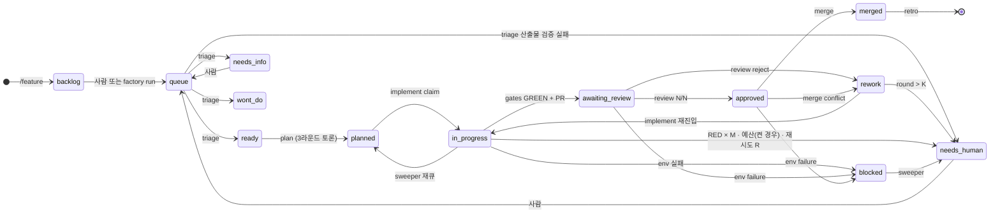

# know-thy-build Factory — 설계 문서

- 날짜: 2026-09-10
- 상태: draft (검토 중)
- 범위: know-thy-build 1.0 — Phase 1(Define, 로컬·사람)과 Phase 2(Build, CI·다크)의 통합 설계
- 선행 논의: own_dark_factory 저장소(폐기 예정)에서의 브레인스토밍. 참고 문헌 요약은 부록 A.

---

## 0. 한 문단 요약

`/feature`로 스펙 문서를 쓰고 GitHub 이슈를 `backlog`로 만든다. 라벨을 `factory:queue`로 옮기는 순간부터 사람은 빠진다. GitHub Actions가 이벤트마다 일회용 러너를 켜고, 러너 위의 `claude -p`가 repo에 커밋된 하네스(`.claude/`, `.factory/`)로 돈다. 스테이지는 `triage → plan → implement → review → merge → retro`이며 각 스테이지는 **라벨 전이로만** 다음 스테이지를 깨우고, 전이는 **직전 스테이지의 산출물(handoff)이 존재할 때만** 스크립트가 수행한다. 그래서 누구도 스테이지를 건너뛸 수 없다. plan과 review에서 에이전트들은 **라운드 구조로 서로의 주장을 읽고 반박**하며, 그 기록은 이슈·PR 코멘트에 남는다. 리뷰어 전원이 approve하고 결정적 게이트가 GREEN일 때 merge 잡이 머지한다. 수렴 실패는 하드 한계에서 `needs-human`으로 멈춘다. retro 잡이 run 기록을 읽어 역할별 lesson을 쌓고(다크, 상한·근거 요건), 역할 자체의 변경·신설은 PR로 제안해 사람이 승인한다.

---

## 1. 원칙

번호는 우선순위다. 충돌하면 앞 번호가 이긴다.

1. **검증할 수 없으면 자율성도 없다.** 다크 모드는 검증기가 사람을 대신한다는 뜻이다. 검증기가 없는 상태(그린필드, `harness.toml` 미완성)에서는 factory가 켜지지 않는다(fail-closed).
2. **강제는 에이전트가 편집할 수 없는 곳에 둔다.** GitHub branch protection과 required check(L0), 에이전트 밖에서 도는 결정적 스크립트(L1)만이 강제다. hooks(L2)와 프롬프트(L3)는 guardrail이다. own-calendar 사례(모든 게이트가 프롬프트에만 있었고 병렬 압력 앞에서 전부 무너짐)를 반복하지 않는다.
3. **스테이지는 건너뛸 수 없다.** 다음 스테이지는 직전 스테이지의 handoff 산출물이 있어야만 시작한다. 라벨을 사람이 손으로 옮겨도 handoff가 없으면 잡이 거부한다.
4. **판단은 상류에서 소진한다.** 치열한 토론은 코드가 쓰이기 전 plan 스테이지에서 한다. review는 판정이며, 반복은 비싸다.
5. **에이전트는 서로의 의견을 읽고 답해야 한다.** 독립 판단 라운드 → 교차 검토 라운드의 2단 구조를 plan과 review 모두에 강제한다. 독립 먼저(집단사고 방지), 교환 나중(사각 제거).
6. **에이전트는 검증기를 속인다고 가정한다.** 작업자와 검증자를 분리하고, 검증자는 작업자의 설명을 읽지 않으며(cold read), 테스트가 수정을 실제로 증명하는지 되돌려 확인한다(prove-test).
7. **상태는 GitHub에만 있다.** 라벨(큐·락·트리거), 코멘트(handoff), 브랜치(진행). 러너·세션·워크트리는 언제든 사라진다. 모든 잡은 재진입 가능하고, 진행은 즉시 push한다.
8. **하드 한계는 라벨·코멘트에 기록된 숫자다.** 라운드 K, 같은 게이트 RED M, 재시도 R, 이슈당 예산(상한을 켠 경우 — 기본은 보고만, §4.4·§5.3·ADR-005). 초과 시 `needs-human`과 함께 "막힌 지점·시도한 것·남은 위험"을 남기고 멈춘다.
9. **배운 것은 프롬프트가 아니라 게이트가 되는 것이 목표다.** lesson은 근거와 상한을 갖는 체크 항목이고, lint/테스트로 표현 가능해지면 게이트로 승격한다. 역할 정의 변경은 사람이 승인한다(LLM 생성 지침의 효과 0 / 비용 +20% — 부록 A).
10. **factory가 필요로 하는 모든 것은 repo에 커밋돼 있다.** 러너는 fresh clone만 본다.

---

## 2. 두 Phase와 CLI

```
Phase 1 · Define (로컬, 대화형, 사람)         Phase 2 · Build (CI, 이벤트 기반, 다크)
──────────────────────────────────────         ──────────────────────────────────────
/know-thy-build:project   → PROJECT.md,        labeled factory:queue
                            harness.toml,        → triage → plan → implement → review
                            스캐폴드+스모크테스트       → merge → retro
/know-thy-build:technical → TECHNICAL.md,
                            CHARTER.md           factory run <stage> <issue>  (로컬에서 같은 잡 실행)
/know-thy-build:qa SETUP  → QA.md
/know-thy-build:feature   → features/NNN.md + 이슈(backlog)
```

### 2.1 CLI

```
npx know-thy-build                     # 카탈로그 스킬 13개 — Define 5 + Operate 8 (§13) — 에 비-카탈로그
                                       #   보조 스킬 architect/designer 2개를 더해 파일 15개를
                                       #   .claude/commands/know-thy-build/ 에 설치
npx know-thy-build factory init        # Phase 2 파일 설치 (.github/ .claude/agents|workflows|hooks .factory/ docs/factory/)
npx know-thy-build factory doctor      # 하네스 계약 검증. 하나라도 비면 exit 1
npx know-thy-build factory bootstrap   # 라벨 세트, branch protection, required checks (repo admin)
npx know-thy-build factory run <stage> <issue>   # 로컬에서 CI 잡과 동일한 스크립트 실행
npx know-thy-build factory status      # Needs You / 큐 / 진행 중 / 최근 머지 (읽기 전용)
```

`init`은 기존 파일을 덮어쓰지 않는다. 업그레이드는 `init --diff`로 차이를 보여주고 `init --upgrade`로 factory 소유 파일만 교체한다(`harness.toml`, `CHARTER.md`, `lessons/`는 절대 건드리지 않음).

(Plan 3 실행 판결, ADR-016) `init`이 설치하는 Claude-side 파일: workflow 스크립트 4개(`.claude/workflows/factory-{triage,plan,implement,review}.js`), role 에이전트 14개(`.claude/agents/*.md` — loader 1 + triage 1 + plan 5 + implement 2 + review 5), 디스패처 커맨드 4개(`.claude/commands/factory-{triage,plan,implement,review}.md`).

(Plan 4 실행 판결, ADR-017) `factory run retro [--force]` — retro는 이슈 인자를 받지 않는다(있어도 무시). `--force`는 CHARTER의 N을 무시하고 전체 retro를 강제 실행한다(§8.4). `init`이 설치하는 retro 관련 파일 5개: `.github/workflows/factory-retro.yml`, `.claude/workflows/factory-retro.js`, `.claude/agents/factory-retro.md`, 디스패처 `.claude/commands/factory-retro.md`, `.factory/lessons/factory-retro.md`(오케스트레이션 본체 `.factory/bin/retro.js`는 이 다섯과 별도로 항상 설치된다).

### 2.2 로컬 실행 `factory run`

"로컬 모드"는 없다. `factory run`은 `.factory/bin/run-stage.sh <stage> <issue>`를 로컬에서 실행하는 것이고, 이 스크립트는 CI의 yml이 호출하는 것과 **같은 파일**이다. 따라서 훅·권한·게이트·handoff 규칙이 동일하다.

- claim은 동일하게 lock 브랜치 first-push-wins. heartbeat 코멘트에 `runner: local/<hostname>`을 남긴다.
- `backlog` 이슈에 `factory run triage 123`을 실행하면 **lock을 먼저 잡고** 그다음 라벨을 `backlog → factory:queue`로 옮긴다(§4.2.5, Plan 2 실행 판결 ADR-015 — R7). 라벨 이벤트로 뜬 GitHub 잡은 claim에 실패해 물러난다. 로컬 실행도 상태 머신 안에서 일어난다. 다른 스테이지는 라벨을 옮기지 않는다.
- 머지는 로컬에서 불가능하다. branch protection이 막고, `factory run merge`는 존재하지 않는다.

---

## 3. 상태 머신

### 3.1 라벨

이슈에는 `factory:*` 라벨이 **정확히 하나** 붙는다(상호 배타). `backlog`는 factory 라벨이 아니며 factory는 이를 무시한다.

| 라벨 | 의미 | 다음 잡 |
|---|---|---|
| `backlog` | 스펙은 있으나 착수하지 않음 | 없음 (사람 또는 `factory run`이 `factory:queue`로) |
| `factory:queue` | 착수 요청 | triage |
| `factory:needs-info` | 이슈가 모호 | 없음 (사람이 보강 후 `queue`) |
| `factory:wont-do` | CHARTER `NEVER_AUTOMATE` 해당 | 없음 |
| `factory:ready` | triage 통과, tier 결정됨 | plan |
| `factory:planned` | 토론 완료, plan handoff 있음 | implement |
| `factory:in-progress` | 브랜치 claim됨, 구현 중 | (heartbeat) |
| `factory:awaiting-review` | PR 있음, gates GREEN | review |
| `factory:rework` | 리뷰 reject, must_fix 있음 | implement (재진입) |
| `factory:approved` | 리뷰어 전원 approve | merge |
| `factory:merged` | 머지 완료, 이슈 closed | retro (입력으로만 사용) |
| `factory:blocked` | 환경·크리덴셜 문제 | sweeper |
| `factory:needs-human` | 하드 한계 초과 또는 handoff 불일치 | 없음 |

보조 라벨(비배타, 6개, (ADR-015)): `factory:tier-docs` / `factory:tier-standard` / `factory:tier-load-bearing` (triage가 부여), `factory:retro-proposal` (retro가 만든 PR), `factory:flaky` (flaky-existing으로 격리된 테스트의 후속 이슈), `factory:harness` (harness 자체에 관한 이슈).

`factory:queue` → `factory:needs-human`: triage 산출물이 검증 실패하면(요구 검사 실패, §3.3) `ready`로 넘어가지 못하고 여기서 바로 전이한다.

### 3.2 전이도



`awaiting_review --> blocked`·`approved --> blocked`는 게이트·GitHub API 조회 자체가 실패했을 때(환경·크리덴셜 문제) 두 스테이지 모두 `blocked`로 끝날 수 있어 생긴 엣지이고, `approved --> rework`는 merge 스테이지가 PR을 `CONFLICTING`으로 판정했을 때(사유 "merge conflict — rebase onto \<default\>") implement 재진입으로 돌려보내는 경로다(Plan 2 실행 판결, ADR-015 — R3).

예산 간선은 **상한을 켠 경우에만 존재한다**(기본 off — §4.4·§5.3, ADR-005). 켜져 있어도 초과는 **다음 claim을 거부하는 방식**으로 작동하며 진행 중인 스테이지를 도중에 죽이지 않는다: 이미 도는 스테이지는 끝까지 가고, 그 다음 전이에서 `needs-human`으로 빠진다.

`planned|rework → in_progress`("implement claim")는 stage=implement일 때 `run-stage.sh`의 2.5단계에서 일어난다 — assert-handoff 직후, `claude -p` 호출 **전**이다(§4.2.1). `in_progress → awaiting_review`는 스테이지 종료 시점, 같은 스크립트의 8단계 전이다.

### 3.3 전이 규칙 — 건너뛰기 불가의 구현

전이는 오직 `.factory/bin/transition.js <issue> <to>`가 수행한다. 이 스크립트는:

1. 현재 라벨이 허용된 출발 상태인지 확인한다(표 3.1의 그래프 밖 전이는 exit 2 — 라벨은 바꾸지 않고 `factory-transition-refused` 코멘트만 남긴다(Plan 2 실행 판결, ADR-015) — merge를 포함해 전이가 조용히 실패하는 지점이 없다).
2. **목적 상태가 요구하는 handoff가 존재하는지** 확인한다(아래 표). 없으면 전이하지 않고 `needs-human` + 사유 코멘트.
3. 라벨을 교체하고 handoff 코멘트를 남긴다.

| 목적 상태 | 요구 handoff | 검사 내용 |
|---|---|---|
| `ready` | `stage=triage` | `disposition=ready`, `tier` 존재 |
| `planned` | `stage=plan` | `done_when[]` ≥1, `files_expected[]`, `dissent_log[]`, 참여 역할 == CHARTER 로스터, 라운드 수 == 3 |
| `awaiting-review` | `stage=implement` | `gates.status=GREEN`, `head_sha` == 브랜치 HEAD, `verifier.verdict=accepted`, PR 번호 |
| `approved` | `stage=review` | `head_sha` == PR HEAD, 판정 수 == 로스터 크기, 전원 `approve`, `round` ≤ K, **이번 스테이지의 `gates.json`이 GREEN** |
| `merged` | (merge 잡 자체가 검사) | required checks GREEN, integrity GREEN, 보호 경로 변경 없음(있으면 needs-human — ADR-020), approved handoff의 `head_sha` == PR HEAD, **이번 스테이지의 `gates.json`이 GREEN** |

review와 merge도 각자 자기 티어의 게이트를 돌린다(§4.2.1 step 5) — `approved`/`merged` 전이가 보는 `gates.json`은 review·merge 자신이 이번 런에서 만든 파일이지 implement의 파일을 재사용하지 않는다. 단 이 검사는 **오직 전이 경로에서만** 작동한다: 스테이지 시작 시점의 선행 handoff 확인(`assert-handoff.sh`, §4.2.1 step 2)은 "직전 스테이지가 산출물을 남겼는가"만 묻고 이번 런의 게이트는 묻지 않는다 — 그 시점엔 이번 런의 게이트가 아직 돌지 않았다(`resetGates`가 지난 런의 파일을 지운 직후다). 두 시점을 구분하는 표식이 `gatesChecked`다: `transition.js`가 전이 직전에만 `gatesChecked=true`를 `gates.json`과 함께 실어 넘기고, `assert-handoff.sh`는 이 값을 절대 세우지 않는다(ADR-012).

사람이 라벨을 `approved`로 손으로 옮겨도 merge 잡은 review handoff를 찾지 못하므로 `needs-human`으로 되돌린다. **건너뛰기는 라벨이 아니라 산출물 부재로 막힌다.**

요구 검사 실패 시 스크립트가 `factory:needs-human`으로 전이하고 `factory-transition-refused` 코멘트를 남긴다; 사람 실행(`--human`)은 전이하지 않고 사유만 반환한다. `assert`/`verify` 실패는 대상 상태에 도달하지 못했다는 뜻이므로, 어느 스테이지에서 일어나든 **그 스테이지가 시작한 현재 라벨**에서 곧바로 `needs-human`으로 전이한다(예: triage 산출물 검증 실패는 `factory:queue`에서, review 산출물 검증 실패는 `factory:awaiting-review`에서) — 목적 상태로 먼저 넘어간 뒤 되돌리지 않는다.

### 3.4 handoff 코멘트 포맷

각 스테이지는 종료 시 이슈(또는 PR)에 코멘트 하나를 남긴다. 사람이 읽을 요약 + 기계가 읽을 블록. 기계가 읽는 블록은 **JSON**이다 — `transition.js` 등의 bash 스크립트가 `jq`만으로 파싱하도록, 별도 YAML 파서 의존성을 피한다.

```markdown
<!-- factory-handoff:v1 stage=plan issue=123 -->
### Plan · round 3 합의 (dissent 1건)

**접근**: `CalendarSync` 서비스에 `since` 커서를 추가해 증분 동기화. 전체 재조회 경로는 유지.
**done_when**
1. `GET /sync?since=<ts>`가 변경분만 반환 (테스트 `test_123_incremental_sync`)
2. 기존 `GET /sync` 동작 불변 (`test_sync_full` 통과)
3. 커서 파싱 실패 시 400 + 에러 코드 `SYNC_BAD_CURSOR`

**dissent**: skeptic — "커서를 timestamp로 두면 동시 쓰기에서 누락 가능. ULID 권장." → 해결: 이번 범위는 timestamp, 후속 이슈 #124 생성.

```json
{
  "schema": "factory.plan.v1",
  "issue": 123,
  "tier": "standard",
  "roles": ["product-advocate", "architect", "skeptic", "operator"],
  "rounds": 3,
  "done_when": [
    { "id": "dw1", "text": "GET /sync?since=<ts> returns only changed events", "verify": "test_123_incremental_sync" },
    { "id": "dw2", "text": "GET /sync without since is unchanged", "verify": "test_sync_full" },
    { "id": "dw3", "text": "invalid cursor -> 400 SYNC_BAD_CURSOR", "verify": "test_123_bad_cursor" }
  ],
  "files_expected": ["src/sync/service.ts", "src/sync/router.ts", "test/sync/*.test.ts"],
  "non_goals": ["ULID cursor", "client-side cache"],
  "dissent_log": [
    { "role": "skeptic", "objection": "timestamp cursor loses concurrent writes", "resolution": "deferred to #124; documented in ADR-017" }
  ],
  "open_risks": ["clock skew between DB and app"],
  "budget_tokens": 400000
}
```
```

`transition.js`는 ` ```json ` 펜스 블록만 `jq`로 파싱한다. 위 요약 텍스트는 사람용이다.

---

## 4. 잡과 러너

### 4.1 워크플로 파일 (factory init이 생성)

| 파일 | 트리거 | `run-stage.sh` 인자 | `timeout-minutes` |
|---|---|---|---|
| `factory-triage.yml` | `issues: labeled` (`factory:queue`) | `triage` | 15 |
| `factory-plan.yml` | `issues: labeled` (`factory:ready`) | `plan` | 60 (최종 리뷰 F8 — 4명 토론 R1·R2 + 종합 + 서명 2회는 opus 4대가 직렬로 도는 구간이 있어 45분으로는 상한이 먼저 온다) |
| `factory-implement.yml` | `issues: labeled` (`factory:planned`, `factory:rework`) | `implement` | 90 |
| `factory-review.yml` | `issues: labeled` (`factory:awaiting-review`) — `pull_request` 이벤트가 아니다(Plan 2 실행 판결, ADR-015 — R1: PR head는 이미 implement handoff의 `head_sha`로 묶여 있어 PR→이슈 매핑이 필요 없다) | `review` | 45 |
| `factory-merge.yml` | `issues: labeled` (`factory:approved`) | `merge` — **스크립트 전용, `claude -p` 호출 없음**(Plan 2 실행 판결, ADR-015 — R3) | 20 |
| `factory-retro.yml` | `pull_request: closed` + `if: merged == true`(`concurrency: { group: factory-retro, cancel-in-progress: false }` — 취소 없이 직렬, cron 없음). 마지막 retro 이후 머지 수가 CHARTER `## Retro`의 N 이상일 때만 전체 실행, 아니면 경량 추출만(§8.4) | `retro [--force]` | 30 |
| `factory-sweeper.yml` | `schedule: */30` | `sweep` | 5 |
| `factory-integrity.yml` | `pull_request: *` | `integrity` | 5 |
| (위 다섯 스테이지 파일의 두 번째 트리거) | `workflow_dispatch` (input: `issue`) — sweeper의 **세 번째 팔**(§4.3)과 `factory run <stage> <issue> --remote`가 여기로 들어온다. 라벨이 이미 목적 상태에 있으면 같은 라벨을 다시 붙여도 `labeled` 이벤트가 나지 않으므로, 런 없이 멈춘 스테이지의 재점화 경로는 이것 하나뿐이다(KTB-8) | 라벨 이벤트와 동일 | 동일 |

(Plan 4 실행 판결, ADR-017) `factory-retro.yml`의 checkout은 `ref: ${{ github.event.pull_request.base.ref }}`다 — PR head/merge ref가 아니라 **머지 결과가 반영된 base 브랜치**를 체크아웃해야 `node .factory/bin/retro.js`가 방금 머지된 커밋을 본다.

yml은 얇다. 모든 로직은 `.factory/bin/`에 있어 로컬 `factory run`과 동일하다.

```yaml
# .github/workflows/factory-implement.yml
name: factory-implement
on:
  issues:
    types: [labeled]
  workflow_dispatch:                           # KTB-8 — 멈춘 스테이지의 유일한 재점화 경로(sweeper §4.3 / `factory run … --remote`)
    inputs:
      issue:
        description: "issue number"
        required: true
        type: string
permissions:
  contents: write
  issues: write
  pull-requests: write
  statuses: write
# KTB-8: 그룹은 **워크플로마다 다르다**. GitHub은 `issues: labeled`에 라벨 이름 필터를 주지 않으므로
# 라벨 이벤트 하나가 스테이지 워크플로 5개의 런을 전부 만든다(필터는 아래 잡 레벨 `if`에 있다).
# 그룹을 공유하면 그 5개가 한 대기 슬롯을 두고 서로를 밀어내고(`cancel-in-progress: false`에서도
# GitHub은 그룹당 실행 1 + 대기 1만 유지한다), 조건이 맞는 유일한 런이 취소돼 이슈가 조용히 멈춘다.
# 이슈 단위 상호배제는 concurrency가 아니라 `.factory/lib/claim.js`의 원자적 락 브랜치가 준다.
concurrency:
  group: factory-issue-${{ github.event.issue.number || inputs.issue }}-implement
  cancel-in-progress: false
jobs:
  implement:
    # dispatch에는 label이 없다 — `github.event.label.name`이 null이라 contains()가 false이므로 이벤트 이름을 먼저 본다.
    if: github.event_name == 'workflow_dispatch' || contains(fromJSON('["factory:planned","factory:rework"]'), github.event.label.name)
    runs-on: ${{ vars.FACTORY_RUNNER || 'ubuntu-latest' }}
    timeout-minutes: 90
    steps:
      - uses: actions/checkout@v4              # R8 — Plan 0 실측 버전 고정(Plan 2 실행 판결, ADR-015)
        with: { fetch-depth: 0 }
      - uses: ./.factory/actions/setup        # node/pnpm 등 harness.toml [runtime] 기준
      - uses: actions/setup-node@v4
        with: { node-version: 22, cache: npm }
      - name: Install Claude Code
        run: npm i -g @anthropic-ai/claude-code
      - name: Test environment
        run: .factory/bin/test-env.sh up        # §5.2.6
      - name: Run stage
        env:
          CLAUDE_CODE_OAUTH_TOKEN: ${{ secrets.CLAUDE_CODE_OAUTH_TOKEN }}   # 구독 (§4.4). 또는 ANTHROPIC_API_KEY
          GH_TOKEN: ${{ secrets.FACTORY_BOT_TOKEN }}     # merge 권한 없는 토큰
          FACTORY_RUNNER_ID: gha-${{ github.run_id }}
        run: .factory/bin/run-stage.sh implement ${{ github.event.issue.number }}
      - name: Upload run record
        if: always()
        uses: actions/upload-artifact@v4
        with:                                            # ADR-009: ${{ }}를 flow mapping 안에 두면 워크플로 파일이 통째로 파싱 실패한다
          name: run-${{ github.event.issue.number }}
          path: docs/factory/runs/
          include-hidden-files: true                     # ADR-009: 템플릿 기본값. dot-디렉토리를 올릴 때(.factory/out 등) 없으면 빈 아티팩트가 된다
```

**같은 그룹의 PENDING 런은 앞 런이 끝난 뒤에 시작한다** — 락은 그때 이미 풀려 있어 claim이 막지 못하므로(claim은 *동시* 러너만 막는다), `run-stage.js`는 락을 잡은 직후 이슈의 현재 상태 라벨이 그 스테이지의 진입 라벨(`triage: factory:queue` · `plan: factory:ready` · `implement: factory:planned|factory:rework` · `review: factory:awaiting-review` · `merge: factory:approved`)인지 보고, 아니면 `claude -p`를 부르기 전에 아무 전이도 handoff도 없이 exit 0으로 물러난다(KTB-10 — 중복 실행에 대한 실질적 방어는 전이 그래프가 아니라 이 가드다. 전이 그래프는 이미 돈 뒤에야 거부한다).

### 4.2 제어 계층 — 오케스트레이터는 세 겹, LLM은 하나

"오케스트레이터가 할 수도 안 할 수도 있는" 구조를 피하려면 재량이 어디에 있는지를 명시해야 한다.

```
L1  run-stage.sh (bash, claude 프로세스 밖)               재량 0
    어느 스테이지를 돌릴지 · claim · context.json 작성 · claude -p 호출 · 판정 · 검증 · 전이
    │
    ▼
메인 세션 (LLM — claude -p의 본체)                        재량 최소화 (디스패처)
    커맨드 파일 = "Workflow 하나를 호출하고 결과를 그대로 돌려줘라"
    --max-turns 5 · 커맨드 frontmatter allowed-tools: Workflow(factory-<stage>)
    │
    ▼
workflow .js (결정적 JS, claude 프로세스 안의 런타임)       재량 0
    누구를(agentType) · 몇 명 · 어떤 순서·라운드 · 어떤 schema. 파일·셸 접근 불가, 분기는 schema 값으로
    │
    ▼
역할 에이전트 ×N (LLM, 같은 프로세스의 별도 컨텍스트)       재량은 자기 과업 안에서만
    .claude/agents/<role>.md(프롬프트·도구·모델·훅) · context.json · lessons · diff를 읽음 · 출력은 schema 강제
```

**Workflow 도구의 정체**: Claude Code 내장 도구로, 모델이 `Workflow({name, args})`를 호출하면 런타임(모델 아님)이 `.claude/workflows/<name>.js`를 샌드박스 JS로 실행한다. 스크립트에 주어지는 API는 `agent / parallel / pipeline / phase / log / workflow / args / budget`뿐이고 fs·네트워크·Node API·`Date.now()`는 없다(결정성·resume 때문). `agent()`는 Agent 도구와 같은 레지스트리로 서브에이전트를 만들고, `schema`를 주면 StructuredOutput을 강제한다. 서브에이전트의 도구 호출은 세션의 permission·hooks를 통과한다. 스크립트의 `return`이 도구 결과다. **다음 단계를 정하는 주체가 모델이 아니라 코드**라는 점이 Agent 도구와의 차이이며, "N명이 반드시 spawn된다"는 보장이 여기서 나온다.

#### 4.2.1 `run-stage.sh`의 골격

```
run-stage.sh <stage> <issue>
  0. charter-ready.sh                        # CHARTER status != ready 또는 doctor 실패 → 즉시 종료
  0.5 trust-workspace.sh                     # ADR-008 — 필수. ~/.claude.json의 projects[<cwd>].hasTrustDialogAccepted = true 를 쓴다.
                                             #   러너의 fresh checkout은 untrusted이고, 그 상태에서는 permissions.allow가 전부 무시되며
                                             #   (경고 "Ignoring N permissions.allow entries ... this workspace has not been trusted")
                                             #   deny가 걸린 세션은 deny에 매칭되지 않는 Bash까지 막는 경우가 관측됐다(ADR-008/ADR-006 상충).
                                             #   trusted 상태에서만 "allow 정상 + deny만 선택 적용"이 성립한다 → L2(§6.3)의 allow·선택적 동작의 전제.
                                             #   CI에서만 실행한다($GITHUB_ACTIONS 또는 $FACTORY_RUNNER_ID가 있을 때만) — run-stage.sh는 로컬에서도
                                             #   돌고, 개발자의 ~/.claude.json을 말없이 고쳐서는 안 된다. 가드는 trust-workspace 자신의 코드다(Plan 1a) — 별도 composite action이 아니다.
  1. claim.sh <issue> <stage>                # 모든 스테이지. lock 브랜치 factory/lock-<issue> push (git ref 생성은 원자적).
                                             #   lock 커밋은 `git commit-tree <빈 트리> -m "lock issue=<issue> stage=<stage> runner=<runnerId> at=<ts>"` — 빈 트리 + 고유 메시지가 매 시도 다른 SHA를 만든다.
                                             #   실패 = 다른 러너/로컬이 선점 → exit 0. heartbeat 시작 — 이슈 코멘트 `<!-- factory-heartbeat issue=<issue> -->` 마커를 10분마다 같은 코멘트에 PATCH로 갱신
  2. assert-handoff.sh <stage> <issue>       # 3.3의 요구 handoff 확인. 없으면 needs-human, exit 2
  2.5 (implement만) transition → in-progress # assert 직후·claude 호출 전. planned|rework → in-progress ("implement claim", §3.2). 거부되면 기록하고 exit 2, 스테이지를 돌리지 않는다
  3. build-context.sh <stage> <issue>        # .factory/out/context.json: 이슈 본문 · 스펙 · 직전 handoff · 이번 잡의 로스터(roles.toml × tier)
                                             #   · CHARTER 한계 · lessons 경로 · orchestration 모드
  4. (merge 제외) claude -p "/factory-<stage> <issue>" \
       --settings .factory/ci-settings.json \
       --max-turns 5 [--max-budget-usd <CHARTER>] \
       --permission-mode dontAsk --output-format json > .factory/out/<stage>.json
     (merge는 이 단계를 **호출하지 않는다** — 스크립트 전용이다(Plan 2 실행 판결, ADR-015 — R3): 이연됐던 결정이
      Plan 2에서 확정됐다. `charter-ready`/`trust-workspace`도 merge에서는 건너뛴다 — claude 프로세스를 띄우지 않으므로
      workspace trust가 필요 없다. 충돌 해소는 conflict → rework 전이로 implement가 재진입해 처리한다.)
     (--max-budget-usd는 CHARTER의 예산 상한을 **켠 경우에만** 붙인다 — 기본은 off이고 factory는 소비를 보고만 한다(§4.4·§5.3, ADR-005).
      켜져 있어도 초과는 다음 claim을 거부할 뿐, 도는 스테이지를 도중에 죽이지 않는다)
     (env: CLAUDE_CODE_PRINT_BG_WAIT_CEILING_MS=0 — 방어적으로 유지하되 진짜 상한은 잡의 timeout-minutes. ADR-007: 단일 Bash 호출이
      10분으로 잘리고 foreground sleep은 Bash 툴이 차단하므로 workflow 에이전트가 기본 ceiling보다 오래 무활동일 수 없다 — 구성상 moot)
     (stdout은 파싱 **전에** 위 리다이렉트로 `.factory/out/<stage>.json`에 verbatim 저장된다 — JSON 파싱이 실패해도 원본이 남고,
      6의 산출물 확인과 `verify-stage.sh` 재실행이 이 파일을 읽는다. §4.4)
  5. gates.sh <level>                        # implement/review/merge. 에이전트 밖에서 실행. 판정 파일 .factory/out/gates.json 생성
                                             #   gates.json이 진실이다 — handoff(7)에 실리는 gates 필드는 이 파일의 복사본일 뿐이고, 워크플로가
                                             #   다른 값을 써 넣으면 6이 "handoff gates mismatch"로 거부하며, 아예 빠뜨렸으면 6이 파일 값으로 채운다(ADR-010).
                                             #   prove-test·new-test-repeat(§5.2.4)와 diff_coverage·mutation(증명 게이트)도 gates.sh 자신이 실행해
                                             #   gates.json의 게이트 항목(prove-test, new-test-repeat, diff_coverage, mutation)으로 합산한다 — 별도 파일로 흩어지지 않는다.
                                             #   실패한 기존 테스트의 flaky 재분류(classify-failure.sh, §5.2.5-③)는 implement에서만 한다 — review·merge는
                                             #   재분류 없이 RED가 RED다(ADR-011). flaky-existing은 이번 판정에서 excluded로 옮기고 제목 `flaky: <id>`로
                                             #   중복 없이 `factory:queue` + `factory:flaky` 이슈를 자동 생성한다.
                                             #   게이트별 되돌림 — 남은 실패가 0이 돼도, 그 게이트 자신이 리포트를 **파싱했고**(parsed:true) 자신의
                                             #   failing_ids가 전부 제외 목록에 들어간 경우에만 그 게이트가 RED→GREEN으로 뒤집힌다. 리포트를 못 읽어
                                             #   이유를 모르는 RED 게이트(e2e 등)는 절대 뒤집지 않는다.
  6. verify-stage.sh <stage> <issue>         # 4의 결과에 workflow 산출물이 있는가: 역할 목록 == context.json 로스터,
                                             #   라운드 수, 판정 수, orchestration == harness.toml 설정. 없으면 needs-human "stage artifact missing"
                                             #   인원·역할의 근거는 훅 기록이다(ADR-001): SubagentStart/SubagentStop 라인의 agent_id·agent_type을 센다.
                                             #   주의 — 확인된 것은 두 필드의 *존재*뿐이다(스파이크 훅이 stdin JSON의 keys만 로깅했다).
                                             #   agent_type의 *값*이 등록된 역할 이름(.claude/agents/<role>)과 같은지는 미확인 → Plan 1의 첫 확인 항목.
                                             #   다르면 로스터 대조는 매핑 테이블을 거치거나 label 등 다른 필드로 바꾼다(인원 수 세기는 그대로 유효).
                                             #   stdout JSON의 subagent_stats는 쓰지 않는다 — Workflow agent()를 세지 않는다(ADR-002: 워커 2명에 spawned 0).
                                             #   permission_denials도 판정 근거로 쓰지 않는다 — trusted 세션에서 항상 비어 있었다(ADR-006 3/3).
                                             #   workflow return contract: workflow가 돌려준 객체가 곧 handoff 데이터다. 스테이지 schema를 만족해야 한다 —
                                             #   plan.v1, implement.v1(head_sha·pr·gates·verifier·orchestration·guarantee), review.v1(verdicts[]·round·head_sha·pr).
                                             #   만족하지 못하면 **여기(6)에서** needs-human으로 실패한다 — 다음 스테이지의 assert-handoff에서가 아니다.
                                             #   review의 decision은 workflow가 정하지 않는다: L1의 aggregate-review.sh가 verdicts[]로 계산해 채운다(§7.5).
                                             #   verdicts 수 < 로스터 크기(incomplete)는 rework가 아니라 needs-human으로 보내고 빠진 역할을 사유에 명시한다.
  7. write-handoff.sh <stage> <issue>        # 4·5 결과를 schema 검증 후 코멘트로 (orchestration · guarantee · workflow_run_id 포함)
                                             #   6이 이미 schema를 통과시켰으므로 7은 재검증하지 않고 6의 data를 그대로 코멘트로 옮긴다
  8. transition.js <issue> <to>              # 3.3 규칙 (implement 성공 시 <to>=factory:awaiting-review; 출발 상태는 2.5가 이미 in-progress로 옮겨 둔 상태)
  9. run-record.sh <stage> <issue>           # docs/factory/runs/<issue>.md를 default 브랜치가 아니라 전용
                                             #   `factory/records` 브랜치에 git plumbing으로 append한다(ADR-014) — 현재
                                             #   체크아웃·인덱스·HEAD(또는 detached HEAD)를 건드리지 않는다. 스테이지
                                             #   시작 시(CHARTER 확인 직후, back-pressure·claim보다 먼저) `hydrateRecord`가
                                             #   이 브랜치에서 기존 run 기록을 먼저 복원하고, 동기화는 로컬이 브랜치 tip의
                                             #   연장이 아니면 공통 접두어 이후의 로컬 꼬리만 tip 뒤에 이어 붙인다 —
                                             #   어느 쪽 내용도 잃지 않는다(ADR-014 보강) · lock 해제
```

**merge 스테이지의 판정.** `factory:merged` 전이가 보는 `checksGreen`·`integrityGreen`은 `run-stage.sh`가 아니라 `mergeGates`(L1)가 채운다: `integrityGreen`은 **로컬 체크아웃 HEAD가 PR head sha와 같을 때만** 계산한다 — 다르면 integrity를 돌리지도 않고 false로 둔다(PR head가 아닌 커밋에 대한 판정은 의미가 없다; 머지 스테이지는 PR head를 체크아웃한 상태로 도는 것이 전제다). `checksGreen`은 `gh pr checks`가 돌려준 체크 전부가 통과일 때만 true다 — 체크가 0개면 "확인 못 함"으로 보고 false(fail-closed). **required 체크만 걸러내는 이름 목록은 아직 없다**: 지금은 모든 체크가 통과해야 하므로 optional 체크의 실패도 머지를 막는다 — 이 필터는 Plan 2의 설정 항목으로 미룬다. `gh pr checks`/integrity 조회 자체가 실패하면 두 플래그 다 세우지 않는다 — 세우지 않은 채로는 §3.3의 `merged` 요구를 통과할 수 없다.

merge 스테이지는 **스크립트 전용**이다 — step 4의 `claude -p "/factory-merge <issue>"` 호출이 없다(Plan 2 실행 판결, ADR-015 — R3, 확정). `merge.integrator`(§7.1)를 spawn해 충돌을 해소하는 대신, PR이 `CONFLICTING`이면 `factory:approved → factory:rework`로 전이해 implement 재진입이 같은 일을 한다. mergeability가 `UNKNOWN`(GitHub 계산 중)이면 `prInfo`를 5초 후 한 번 재조회하고, 그래도 `MERGEABLE`이 아니면 `factory:needs-human`으로 전이한다(사유 "mergeability unknown after re-poll") — 무한정 기다리지 않는 fail-closed 처리다(Plan 2 실행 판결, ADR-015 — R3).

#### 4.2.2 커맨드 파일 — `.claude/commands/factory-implement.md`

패키지가 설치하고 protected다. 절차·역할·라운드는 여기 없다(그건 workflow .js). 이 파일의 역할은 디스패치뿐이다.

```markdown
---
description: factory implement stage dispatcher
allowed-tools: Workflow(factory-implement)
---
You are a dispatcher. Do exactly one thing:

Call the Workflow tool with name `factory-implement` and args
`{ "issue": $ARGUMENTS, "context": ".factory/out/context.json" }`.

Return the workflow's result verbatim as your final message. Do not read files,
run commands, edit anything, or add commentary. If the workflow fails, return its
error verbatim.
```

메인 세션이 workflow를 호출하지 않으면 6에서 잡힌다. 건너뛰기는 성공으로 위장할 수 없고 잡 실패로 드러난다. **건너뛰기를 막는 메커니즘은 `verify-stage.sh`의 사후 검증 하나뿐이다** — 메인 세션만 선택적으로 잠그는 수단은 존재하지 않는다(ADR-006: frontmatter `allowed-tools`는 grant 힌트일 뿐 restrict가 아니고, `--allowedTools`는 `dontAsk` 아래에서 게이트로 작동하지 않으며, `--disallowedTools`는 서브에이전트까지 함께 막는다). 따라서 여기의 `allowed-tools:`는 의도 선언이지 강제 장치가 아니며, 건너뛰기는 **불가능이 아니라 감지**다. 감지의 근거는 workflow 산출물의 존재와 훅 로그의 `agent_id`/`agent_type`이다(ADR-001).

#### 4.2.3 각 층이 읽는 것

| 층 | 읽는 것 | 어디 |
|---|---|---|
| L1 | 라벨, handoff 코멘트, `roles.toml`, `CHARTER.md`, `harness.toml` | GitHub API + repo |
| 메인 세션 | 커맨드 파일 본문 + `$ARGUMENTS` | `.claude/commands/` |
| workflow | `args`(이슈 번호, context 경로) + 에이전트가 돌려준 schema 값 | 인자와 반환값뿐 — 파일을 못 읽음 |
| 역할 에이전트 | 자기 `.md`, `context.json`, `.factory/lessons/<role>.md`(프롬프트에 경로가 주어지고 직접 읽는다), diff·코드(cold read 규칙 내에서) | 러너 파일시스템 |

workflow가 파일을 못 읽으므로 로스터는 두 단계로 간다: L1이 이번 잡의 로스터를 `context.json`에 확정해 쓰고, workflow의 첫 스텝인 loader 에이전트(sonnet)가 그 파일을 읽어 schema로 돌려준다. loader가 역할을 지어내면 다음 `agent({agentType})`이 존재하지 않는 파일로 실패하고, 6에서 로스터 불일치로 잡힌다.

**loader 확정 문장** (Plan 3 실행 판결, ADR-016): `factory-loader`(sonnet, `tools: Read, Bash, Grep`, `hooks.PreToolUse`는 `deny-all-writes.sh`)는 `roles.toml`의 어떤 `[stage.<name>]` 블록에도 속하지 않는다 — 로스터 역할이 아니라 네 workflow 모두의 첫 스텝이라서다. 네 workflow(`factory-triage.js`/`factory-plan.js`/`factory-implement.js`/`factory-review.js`)는 바이트 단위로 동일한 `LOADER` schema 리터럴을 공유한다:

```js
const LOADER = {
  type: 'object',
  required: ['issue', 'stage', 'tier', 'roster', 'orchestration'],
  properties: {
    issue: { type: 'number' }, stage: { type: 'string' }, tier: { type: 'string' },
    maturity: { type: 'string' },   // harness.maturity 그대로 — plan이 done_when level을 이걸로 묶는다
    roster: { type: 'array', items: { type: 'object', required: ['name', 'agentType', 'model'],
      properties: { name: { type: 'string' }, agentType: { type: 'string' }, model: { type: 'string' }, lessons: { type: 'string' } } } },
    rounds: { type: 'number' }, limits: { type: 'object' }, spec_path: { type: 'string' },
    pr: { type: 'number' }, head_sha: { type: 'string' },
    must_fix: { type: 'array', items: { type: 'object' } }, disputed: { type: 'array', items: { type: 'object' } },
    orchestration: { type: 'string' },
  },
};
```

위 표의 "역할 에이전트가 `context.json`을 읽는다"는 문자 그대로다 — 네 workflow의 역할 프롬프트는 전부 `Read \`${args.context}\`` (즉 `.factory/out/context.json`)로 시작하고, 각 역할이 그 파일을 자기 손으로 다시 연다. loader가 있는 이유는 역할이 아니라 **workflow 스크립트 자신**이 파일을 못 읽기 때문이다(§4.2 표의 workflow 행) — loader는 그 파일을 읽어 로스터 부분집합(이름·`agentType`·`model` 등)만 schema로 workflow에 돌려주고, workflow는 그 schema 값으로 몇 명을 어떤 이름·모델로 spawn할지만 결정한다. 즉 loader의 산출물은 workflow의 분기 재료이지 역할 에이전트에게 전달되는 `context.json`의 대체물이 아니다 — 역할 에이전트는 loader를 거치지 않고 같은 파일을 독립적으로 연다. loader-null(1회 재spawn 후에도 null 또는 throw)과 issue-mismatch(`Number(loaded.issue) !== issue`, 스테일 `context.json` 방지)는 네 workflow 모두 같은 모양으로 fail-closed 응답한다 — `{issue, error, orchestration: 'workflow', guarantee: 'structural'}`뿐, stage 필드(`disposition`/`done_when`/`verifier`/`verdicts` 등)는 아예 싣지 않는다. 각 스테이지 schema가 그 필드를 required로 두므로 `verify-stage`가 그대로 실패시켜 needs-human이 된다 — 별도의 에러 처리 경로가 필요 없다. `once(fn)`은 null과 throw를 모두 "대답 없음"으로 묶어 정확히 1회만 재spawn한다.

#### 4.2.4 orchestration 모드 — 후퇴는 설정이지 동작이 아니다

`harness.toml [factory] orchestration = "workflow" | "agent"` (기본 `workflow`, protected).

- 런타임에 Workflow 호출이 실패하면(도구 없음, 권한 거부, 사양 불일치) 잡은 `blocked` + 사유 `orchestration-unavailable`로 끝난다. **자동으로 agent 모드로 바꿔 돌지 않는다.** sweeper → `needs-human` → `:unstick`이 전환 여부를 묻고, 전환은 `harness.toml` PR(사람 머지)이다.
- 모든 handoff와 run 기록에 `orchestration: workflow|agent`, `guarantee: structural|verified`, `workflow_run_id`가 남는다. 여기에 `-p` 출력 JSON의 `usage`·`total_cost_usd`·`modelUsage`·`num_turns`·`terminal_reason`·`permission_denials`를 함께 싣는다(ADR-002에서 존재 확인 — §9 run 기록, §4.4 사용량 보고). `structural` = 코드가 N명을 띄웠음, `verified` = 사후에 판정 수 == 로스터를 확인했을 뿐. `verify-stage.sh`는 handoff의 `orchestration`이 설정과 일치하는지 검사한다.
- `:digest`와 retro가 모드별 머지 수를 보고한다. 설계 시점의 후퇴 결정은 `docs/factory/DECISIONS.md`에 ADR로 남긴다(무엇을 잃는지 — 구조적 보장 → 감지 — 명시).

#### 4.2.5 로컬과 GitHub의 경쟁 — claim이 라벨보다 먼저

라벨이 `queue`가 되는 순간 GitHub Action이 뜬다. 로컬 `factory run`이 라벨부터 바꾸면 GitHub이 먼저 잡는다. 따라서 `factory run <stage> <issue>`는 **lock을 먼저 잡고 그다음 라벨을 옮긴다.** 라벨 이벤트로 뜬 GitHub 잡은 claim에 실패해 즉시 종료한다 — 로컬이 이긴다. 사람이 GitHub UI에서 라벨을 옮기면 GitHub 잡이 먼저 claim한다 — GitHub이 이긴다. 승자는 행위에서 결정되고 둘이 동시에 도는 일은 없다. lock은 스테이지 종료 시 삭제, heartbeat 끊긴 lock은 sweeper가 회수.

이 "claim 뒤 라벨 이동" 경로를 실제로 타는 것은 **`factory run triage`뿐이다** — 이슈 라벨이 정확히 `backlog`일 때 lock을 잡은 직후 `backlog → factory:queue`로 옮긴다(Plan 2 실행 판결, ADR-015 — R7). 다른 스테이지(`plan`/`implement`/`review`)는 라벨을 옮기지 않는다 — 전이는 오직 `assert-handoff`/`transition`이 처리한다. `factory run merge`는 CLI에 없다(§2.1).

에이전트(4)는 gates를 **돌릴 수는 있지만 판정할 수 없다.** 판정은 5의 파일이며, 에이전트 출력에 "GREEN"이라 적혀 있어도 6은 5의 파일만 읽는다.

### 4.3 러너의 죽음에 대한 대비

- 잡은 짧다(표 4.1). 6시간 상한은 문제가 아니다.
- 구현 에이전트는 논리 단위마다 커밋·push한다. `Stop` 훅이 미push 변경이 있으면 종료를 거부한다.
- **sweeper**(`factory-sweeper.yml`, 30분 주기 → `.factory/bin/sweep.js`)가 네 가지를 훑는다:
  1. `factory:in-progress` 이슈의 heartbeat 코멘트(`<!-- factory-heartbeat issue=<n> -->`)가 30분 넘게 갱신되지 않았으면 lock을 회수하고, 같은 이슈의 `factory-retry issue=<n> count=<k>` 마커를 읽어 count+1이 R 이하면 `factory:planned`로 되돌린다(재큐 — §3.2 `in_progress --> planned` 엣지, 다음 재큐 코멘트에 갱신된 count가 남는다). count가 R을 넘으면 `factory:needs-human`으로 보낸다.
  2. `factory:blocked` 이슈는 재시도하지 않고 곧바로 `factory:needs-human`으로 올린다 — 환경·크리덴셜 문제는 sweeper가 고칠 수 없다(§3.2 `blocked --> needs_human`).
  3. 격리 정책(`.factory/quarantine.toml`, §5.2.5-⑤)을 적용한다: `consecutive_passes ≥ quarantine_return_after`인 항목은 복귀시키고, `quarantine_ttl_days` 경과 또는 `since` 파싱 실패(fail-closed) 항목은 만료 처리한다.
  4. 토큰 발급일(`FACTORY_TOKEN_ISSUED_AT`)이 334일(≈11개월)을 넘으면 "토큰 갱신 필요" `factory:needs-human` 이슈를 연다 — 같은 제목의 열린 이슈가 있으면 중복 생성하지 않는다(§4.4).
  각 이슈·각 서브 스텝은 개별적으로 실패가 격리된다 — 하나가 에러를 던져도 나머지는 계속 처리된다.
- Claude Workflow의 resume은 세션 디렉토리에 의존하므로 **쓰지 않는다.** 재진입은 브랜치·handoff에서 한다.

### 4.4 의존성과 인증

러너에는 Claude Code가 없다. 잡마다 설치한다(문서 근거: setup.md, github-actions.md, authentication.md).

| 항목 | 값 |
|---|---|
| Node | **22 이상** (Claude Code v2.1.198+ 요구). `actions/setup-node@v4`로 고정 |
| CLI 설치 | `npm i -g @anthropic-ai/claude-code` (npm 캐시는 `actions/cache`). 또는 `curl -fsSL https://claude.ai/install.sh \| bash` |
| 인증 A — 구독 (**기본**) | `claude setup-token` → `CLAUDE_CODE_OAUTH_TOKEN`. **유효 1년**, 자동 갱신 없음. 문서가 CI 사용을 명시적으로 허용. 모델 요청만 가능(claude.ai 커넥터·Remote Control 불가 — factory는 필요 없음). **CI 소비는 개인 구독의 7일 창에 그대로 반영된다**(ADR-005: 스파이크 0~8 동안 92% → 94%, 사람 자신의 세션과 혼재되어 +2%p는 상한) |
| 인증 B — API key | `ANTHROPIC_API_KEY`. 만료 없음, 종량 과금. **동작하지만 권고가 아니다**(ADR-005) — 구독 토큰이 운영 모드다 |
| 우선순위 | 둘 다 있으면 OAuth 토큰이 `/login` 자격증명보다 우선. 스크립트는 둘 중 하나만 요구 |

운영 규칙:
- `bootstrap`이 토큰 발급일을 repo variable `FACTORY_TOKEN_ISSUED_AT`에 기록한다. sweeper가 **11개월** 시점에 `needs-human` 이슈("토큰 갱신")를 생성한다. 인증 실패는 `blocked` 경로로 빠진다.
- `doctor`는 두 시크릿 중 하나의 존재를 확인한다(값은 보지 않는다).
- `claude -p` stdout은 파싱 전에 `.factory/out/<stage>.json`에 그대로(verbatim) 저장된다(§4.2.1 step 4) — JSON 파싱 실패해도 원본이 남고, run 기록의 `usage`/`total_cost_usd` 추출과 `verify-stage.sh` 재실행이 이 파일을 근거로 한다.
- 구독 → API key 전환은 시크릿 교체만으로 끝나야 한다. 스크립트는 인증 방식을 참조하지 않는다.
- **사용량은 제한하지 않고 보고한다**(ADR-005). 구독 토큰이 기본이고 CI 소비는 사람의 7일 창에서 나가므로, factory의 책임은 "얼마나 썼는지 보이게 하는 것"까지다: 잡마다 `-p` 출력 JSON의 `usage`·`total_cost_usd`·`modelUsage`를 run 기록(§9)에 남기고, 이슈별 합계와 주간 합계를 `factory status`·retro·`:digest`가 표시한다. **한도 판단과 토큰 갱신은 사람이 한다 — factory가 한도를 이유로 스스로 멈추지 않는다**(CHARTER의 이슈당 토큰 예산은 선택이며 기본 off, §5.3).

### 4.5 러너 환경 — 되는 것과 안 되는 것

러너는 repo checkout과 잡에서 설치한 것만 본다. 로컬 머신의 것은 아무것도 없다.

| 항목 | 러너에서 | 대응 |
|---|---|---|
| 로컬 `~/.claude/` 스킬·플러그인·설정 | **없음** | factory가 쓰는 스킬·에이전트·워크플로·훅은 전부 `.claude/`에 **커밋** (원칙 10). `factory init`의 존재 이유 |
| claude.ai 커넥터 (Linear, Slack, Drive) | **없음** — 구독 토큰은 모델 요청만 | GitHub 연동은 `gh` CLI. 이슈 트래커는 GitHub Issues만(1.0) |
| MCP 서버 | **가능** | repo의 `.mcp.json`(project scope). **trust 부트스트랩(§4.2.1 step 0.5)이 선행되면 `enableAllProjectMcpServers` 없이 그대로 로드된다**(ADR-004 실측). qa 리뷰어의 playwright MCP는 `npx @playwright/mcp --headless` — 러너에서 headless 구동 확인(ADR-004) |
| Docker / compose | **기본 설치** | DB·fake 서버 |
| Chrome/Chromium/Firefox | **기본 포함** | playwright 브라우저는 `npx playwright install --with-deps chromium` (캐시 가능) |
| 앱 실행 | **가능** — 백그라운드 + localhost | GUI 없음, **headless만** |
| 웹/API e2e | **가능** | 위 조합 |
| 모바일 네이티브 (iOS 시뮬레이터) | **제한** — macOS 러너 필요(분당 비용 10배), Android 에뮬레이터는 ubuntu에서 느림 | 로직·API는 웹 레벨 e2e, 모바일 UI는 위젯 테스트 + 빌드 성공까지만 gate. 필요 시 self-hosted macOS 러너(`vars.FACTORY_RUNNER`) |
| 자원 | ≈4 vCPU / 16GB / 14GB SSD | **동시 실행 검증됨**(ADR-004, `ubuntu-latest`): compose(postgres) + 앱 + chromium + playwright MCP를 함께 띄운 뒤에도 가용 메모리 6.5~6.7GB/7.9GB 유지, env_up 36s. 대형 러너 불필요. 단 측정 대상이 사소한 데모 앱이라 `runtime_budget_min` 기본값 12는 dogfood(§12.3)까지 그대로 둔다 |

---

## 5. 하네스 계약

프로젝트가 채우는 파일은 둘이다. 나머지는 factory 소유.

### 5.1 `.factory/harness.toml` (예시 — TypeScript 프로젝트)

```toml
schema = 1

[project]
name        = "own-calendar"
spec_dir    = "docs/features"        # /feature가 쓰는 곳. 이슈 본문이 여기를 링크
runs_dir    = "docs/factory/runs"
default_branch = "main"

[runtime]
setup = "pnpm install --frozen-lockfile"
node  = "22"

[commands]                            # 전부 exit code로 판정. 출력은 run 기록에 첨부
lint        = "pnpm lint"
lint_file   = "pnpm eslint {file}"                                     # §6.3 lint-touched.sh가 건드린 파일 하나에만 돌린다 (로깅형, 절대 차단 안 함)
typecheck   = "pnpm tsc --noEmit"
unit        = "pnpm vitest run --project unit --reporter=json --outputFile=.factory/out/unit.json"
integration = "pnpm vitest run --project integration --reporter=json --outputFile=.factory/out/integration.json"
e2e         = "pnpm playwright test --reporter=json --output=.factory/out/e2e"
build       = "pnpm build"
test_files  = "pnpm vitest run {files}"                                # §5.2.4 prove-test·new-test-repeat: 지정한 테스트 파일들만 실행
test_one    = "pnpm vitest run {file} -t {name}"                       # §5.2.5-③ classify-failure: 테스트 하나만 격리 재실행
                                                                       #   계약: {file}·{name} 둘 다 **스크립트가 셸 따옴표를 붙인다**. 하네스에서 '{name}'처럼
                                                                       #   직접 감싸지 말 것 — 이름에 든 작은따옴표가 명령을 깨거나 주입 경로가 된다

[harness]
maturity = "M2"                        # M0 | M1 | M2 (§5.2.1). 승격은 factory:harness 이슈 + 사람 머지

[factory]
orchestration   = "workflow"           # workflow | agent (§4.2.4). 런타임에 자동 전환되지 않는다
required_checks = ["factory/gates", "factory/review", "factory/integrity"]   # 기본값(Plan 2 실행 판결, ADR-015). branch protection과 merge 게이트 필터가 같은 목록을 쓴다

[commands.proof]                       # 증명 게이트 (§5.2.4). 측정은 gates.sh(diff-coverage.js/mutation.js)가, 임계는 여기(protected)에
coverage        = "pnpm vitest run --coverage --coverage.reporter=json"   # diff coverage가 돌릴 커버리지 명령.
                                                                          #   [commands].unit이 이미 커버리지를 뱉는다면 여기에 **같은 명령을 그대로 써도 된다**
                                                                          #   (그러면 한 스테이지에서 두 번 돈다 — 정확성 우선, 중복 실행은 허용)
coverage_report = ".factory/out/coverage/coverage-final.json"            # istanbul JSON. diff-coverage.js가 변경 줄과 대조
mutation        = "pnpm stryker run --incremental --mutate $(git diff --name-only origin/main -- 'src/**/*.ts')"
mutation_report = "reports/mutation/mutation.json"                       # Stryker --incremental 기본 경로. mutation.js가 읽는다

[gates]
required = ["lint", "typecheck", "unit", "integration", "e2e", "build", "diff_coverage", "mutation"]   # 성숙도까지의 명령. skip이면 MISCONFIGURED (exit 2)
fast     = ["lint", "typecheck", "unit"]                                        # + prove-test, 새 테스트 3회 반복
full     = ["lint", "typecheck", "unit", "integration", "build", "diff_coverage"]
deep     = ["lint", "typecheck", "unit", "integration", "build", "diff_coverage", "e2e", "mutation"]

[gates.thresholds]
diff_coverage_pct  = 90                # 변경 줄 기준
mutation_score_pct = 70                # 변경 파일 기준
new_test_repeats   = 3                 # §5.2.5-②
flaky_isolation_runs = 3               # §5.2.5-③ PR 코드 격리 재실행
flaky_base_runs    = 5                 # §5.2.5-③ main 재실행
quarantine_max     = 5                 # §5.2.5-⑤ 초과 시 implement claim 거부. 이 값이 quarantine 상한의 유일한 출처다(CHARTER에는 두지 않는다 — §5.3)
quarantine_ttl_days = 28
quarantine_return_after = 30           # §5.2.5-⑤ 연속 통과 시 자동 복귀

[test]                                 # §5.2 테스트 계약. /qa SETUP이 작성하고 doctor가 실행한다
guide        = "docs/QA.md"            # builder·qa 리뷰어의 필수 입력. 레벨별 작성법·fixture·네이밍
naming       = "test_{issue}_{slug}"   # done_when.verify가 가리키는 id 규약
smoke        = { unit = "test/unit/smoke.test.ts", integration = "test/integration/smoke.test.ts", e2e = "e2e/smoke.spec.ts" }
runtime_budget_min = 12                # full 레벨 소요 시간 상한. 초과가 3회 연속이면 retro가 분할 제안
test_glob    = ["test/**/*.test.ts", "e2e/**/*.spec.ts"]   # changed-files.js가 "이번 diff의 테스트 파일"을 가르는 기준(§5.2.4)
source_glob  = ["src/**/*.ts"]                              # diff coverage의 분모, mutation의 대상 파일 선택 기준
unit_report  = ".factory/out/unit.json"                     # integration_report/e2e_report도 같은 규약: <level>_report, 기본값 .factory/out/<level>.json

[test.env]
compose   = "docker-compose.test.yml"  # 로컬·CI 동일. CI는 services: 로 치환 가능
env_file  = ".env.test"                # 커밋됨. 시크릿 없음
seed      = "pnpm db:migrate:test && pnpm db:seed:test"
app_start = "pnpm start:test"          # e2e·qa 리뷰어용 앱 기동
app_ready = "http://localhost:3000/healthz"
ready_timeout_sec = 90

[test.fakes]                           # 외부 서비스는 절대 실제 호출하지 않는다
google_calendar = "pnpm fake:gcal"     # 포트·동작은 QA.md §3에 정의

[protected]                            # 이 경로 변경이 PR에 있으면 자동 머지 없음 — 사람이 머지한다 (ADR-020)
factory  = [".factory/**", ".claude/**", ".github/workflows/factory-*.yml", "docs/factory/CHARTER.md"]
except   = [".factory/lessons/**", "docs/factory/runs/**"]   # 예외. 대신 integrity가 포맷·상한·근거 링크를 검사
additive_only = { ".claude/agents/*.md" = ["## Examples", "## Perspectives"] }   # 이 두 섹션의 '추가' diff만 허용 (§8.1)
tests_are_load_bearing = true          # 기존 테스트 파일 수정은 verifier가 reject

[load_bearing]                          # 이 경로가 diff에 있으면 tier가 load-bearing으로 승격
paths = ["src/auth/**", "src/sync/**", "prisma/schema.prisma", "src/api/public/**"]

[evidence]
qa_artifacts = ".factory/out/qa/**"     # qa 리뷰어의 스크린샷·로그. PR 코멘트에 첨부됨
```

**`[protected]`을 집행하는 자리는 둘로 나뉜다(ADR-020 KTB-5·KTB-6).** `factory/integrity` 체크(L0)는 **변조만** RED로 만든다 — lessons 포맷·상한·근거, 테스트 skip/ignore pragma, 그리고 판정 불가. 나머지 둘은 "이 diff가 틀렸다"가 아니라 **"누가 머지해도 되는가"의 정책**이라 체크를 RED로 만들지 않고 잡 로그의 알림 한 줄로만 남는다:

- `[protected].factory` 매치 파일이 diff에 **있다**는 사실(KTB-5) → `integrity: protected paths changed (human merge required): …`
- `[protected].additive_only`의 허용 섹션(`.claude/agents/*.md`의 `## Examples`/`## Perspectives`)을 **벗어난 편집**(KTB-6) → `integrity: agent role sections edited outside the allowed sections (human merge required): …`

그런 PR의 **자동 머지를 거부하는 것은 merge 스테이지(L1)**다 — 둘 중 하나라도 걸리면 머지하지 않고 `factory:needs-human`으로 전이해 사람이 diff를 보고 직접 머지하게 한다. 이렇게 나누는 이유: `factory/integrity`는 branch protection에 등록된 **유일한** required context라(ADR-015 보강), 이 체크가 RED가 되면 봇만이 아니라 **사람도** 그 PR을 머지할 수 없다 — 그러면 설계가 전제하는 사람 머지 경로가 통째로 막힌다. KTB-5가 막고 있던 것은 retro-proposal PR·`factory:harness` 승격 PR·인프라 업그레이드 PR이고, KTB-6이 막고 있던 것은 **모든 역할 프롬프트 변경**이다 — `/know-thy-build:role`이 여는 PR 전부와, 에이전트 파일을 건드리는 모든 패키지 업그레이드.

`doctor`는 `[commands]`의 각 명령을 실제로 실행해 exit 0인지, `[gates].required`가 전부 `[commands]`에 있는지, `[protected].factory` glob이 실제 파일에 매치되는지, 훅 스크립트가 stdin JSON을 읽는지, `[test.env]`로 환경을 띄워 `[test].smoke` 세 개가 GREEN인지를 검사한다.

### 5.2 테스트 계약 — 테스트는 어디서 오고 어떻게 자라는가

gate의 실체는 `harness.toml`의 명령이 아니라 **main에 누적된 테스트 스위트**다. 이 절은 그 스위트가 누구에 의해 생기고, 이슈마다 어떻게 자라며, 무엇이 그것을 보호하는지 정한다.

#### 5.2.1 테스트 능력과 테스트 케이스는 다르다 — 하네스 성숙도

테스트 케이스는 이슈의 스펙에서 나온다(TDD: done_when → 테스트 → 구현). 그린필드에는 스펙도 소스도 없으므로 테스트 케이스를 미리 만들 수 없다. 미리 만들 수 있는 것은 **능력**(러너, 환경, 규약)뿐이고, 그것도 스택이 존재하는 만큼만이다. 그래서 능력은 단계적으로 자란다.

| 성숙도 | 조건 | 켜지는 레벨 | 누가 올리나 |
|---|---|---|---|
| **M0** | 테스트 러너 설치, `unit` 스모크 1개(`expect(true)` 수준이면 충분), lint·typecheck | `fast` | `/project`. **그린필드는 여기서 factory가 켜진다** |
| **M1** | DB·서비스 등장 → `docker-compose.test.yml`, seed, `integration` 스모크, diff coverage 도구, mutation 도구 | `full` | **factory 자신** — `factory:harness` 이슈 |
| **M2** | HTTP/UI 표면 등장 → 앱 기동·ready URL, fake 서버, `e2e` 스모크, playwright | `deep` | 동일 |

- `harness.toml [harness].maturity = "M0" | "M1" | "M2"`. `[gates].required`는 해당 성숙도까지의 명령만 요구하고, `doctor`는 선언된 것만 검사한다. CHARTER의 tier 표에서 `deep`이 필요한 tier는 M2 전까지 `full`로 강등되며 그 사실이 run 기록에 남는다.
- **승격은 이슈다.** retro(또는 사람)가 "prisma schema가 생겼는데 M0"처럼 능력 부족을 감지하면 `factory:harness` 라벨의 이슈를 만든다. 이 이슈는 일반 파이프라인(plan→implement→review)을 타되, `harness.toml` 변경이 포함되므로 merge 스테이지(L1)가 자동 머지를 거부하고 **사람이 머지**한다(ADR-020 — `factory/integrity` 체크는 변조만 RED로 만들므로 사람의 머지는 막히지 않는다). 즉 인프라 작업은 factory가 하고, gate 정의의 변경만 사람이 승인한다(원칙 2·9와 일치).
- 브라운필드는 `/project` evolve 모드가 현재 코드에서 성숙도를 판정해 M1·M2로 바로 시작한다.
- **빈도**: M0→M1→M2는 프로젝트 생애에 최대 2번. 그 외 능력 추가(새 외부 의존성의 fake 서버, 새 도구 설정, contract test 같은 새 레벨)가 그린필드 첫 달 2~4건, 이후 월 1건 이하로 예상. retro의 감지 규칙 초기값 세 가지: 매니페스트에 외부 SDK가 추가됐는데 `[test.fakes]`에 없음 / DB 스키마가 있는데 M0 / HTTP 라우트가 있는데 M1.

#### 5.2.2 누가 무엇을 쓰나

| 시점 | 누가 | 산출물 | 검증 |
|---|---|---|---|
| Phase 1 `/project` | 사람 + claude (대화) | M0: 러너, `[commands].unit`, unit 스모크, `maturity = "M0"` | `doctor` |
| Phase 1 `/qa SETUP` | 사람 + claude (대화) | **규약**: `docs/QA.md`(레벨별 작성법, fixture·네이밍, 행위 축·프로파일, 증거 캡처법, 결정성 규칙 §5.2.5-①). 브라운필드면 현재 성숙도의 환경 파일까지 | `doctor` |
| Phase 2 `factory:harness` 이슈 | builder (factory) | M1·M2 승격: compose, seed, fake 서버, 스모크, 도구 설치, `harness.toml` diff | 일반 리뷰 + **사람 머지** |
| Phase 2 plan | 토론자 → synthesizer | `done_when[].verify`에 테스트 id와 **레벨** 지정. 현재 성숙도에 없는 레벨은 지정 불가. 테스트 없는 done_when은 schema 거부 | `assert-handoff` |
| Phase 2 implement | builder | `verify` 테스트를 **먼저** 작성 → RED → 구현 → GREEN | verifier `prove-test` + `gates.sh` |
| Phase 2 review | qa 리뷰어 | 앱을 띄워 직접 조작, 증거를 `[evidence].qa_artifacts`에, hold-out 시나리오 | spec-conformance가 증거 유무 확인 |
| Phase 2 retro | retro | 성숙도 승격 이슈 생성, 느린 스위트 분할 제안, 결정성 규칙의 lint 승격 제안, flaky 통계 | `retro-proposal` → 사람 (승격 이슈 생성 자체는 다크) |

#### 5.2.3 에이전트가 테스트 작성법을 아는 경로

builder와 qa 리뷰어의 "You receive"에 다음이 명시된다. 전부 repo에 있다.
1. `docs/QA.md` — 이 프로젝트에서 각 레벨의 테스트를 어떻게 쓰는가 (fixture, factory 함수, fake 서버 사용법, 증거 캡처)
2. `docs/TECHNICAL.md` §Testing Strategy — 무엇을 어느 레벨에서 검증하는가
3. plan handoff `done_when[].verify` — 이번 이슈에서 무엇을, 어느 레벨에서
4. `[test].smoke` 세 파일 — 살아 있는 최소 예제
5. `.factory/lessons/factory-builder.md`, `reviewer-qa.md` — 과거 실패에서 배운 것

(Plan 3 실행 판결, ADR-016) correctness·security·architecture 리뷰어는 plan handoff를 읽지 않는다 — cold read가 그 세 역할에게는 §7.1의 일반 규칙 그대로 적용돼 코드와 diff만 판단 근거가 되고, plan handoff 접근은 spec-conformance(`cold_read = false`)와 qa(§7.5의 `done_when`만)에 한정된다.

#### 5.2.4 성장 규칙과 증명 게이트

- 이슈당 `done_when` 항목 수 ≤ 새 테스트 수. 회귀 가드는 `test_<issue>_<slug>`로 이름 붙여 추적 가능하게.
- **기존 테스트 수정 금지**(`tests_are_load_bearing`). 불가피하면 spec-conformance 리뷰어가 사유와 함께 `must_approve_explicitly`로 승인하고, 해당 PR은 tier가 load-bearing으로 승격된다. 예외: `factory:flaky` 이슈는 그 이슈가 지목한 테스트 id에 한해 수정 가능. 삭제는 §5.2.5-④의 TTL 경로로만.
- `[test].runtime_budget_min` 초과가 3회 연속이면 retro가 `fast` 레벨 선택 규칙(변경 경로 기반 선택 실행) 또는 샤딩을 제안한다. 그 전까지는 느려도 전부 돈다.

**대상 파일 — "새 테스트"와 "변경된 테스트"는 다른 로직에 쓰인다.** `prove-test`·`new-test-repeat`은 이번 PR에서 **변경된 테스트 파일 전부**(추가 A + 수정 M, rename R은 새 경로 기준. 삭제 D는 제외 — 돌릴 수도 커버리지를 잴 수도 없다)를 대상으로 한다: 기존 파일에 케이스를 추가했을 뿐이어도 base에 얹으면 실패해야 증명된다. 반면 `classify-failure.sh`의 "새 테스트 → red" 규칙(§5.2.5-③ step 1)은 **git이 `A`로 잡은 파일만**(`addedTests`)을 새 테스트로 본다 — 기존 파일을 수정해 만든 케이스는 새 테스트 취급하지 않고 기존 테스트의 flaky/introduced 분류 경로를 그대로 탄다. `new_test_repeats` 임계가 설정돼 있지 않으면(`[gates.thresholds]` 누락) `new-test-repeat` 게이트는 "돌았지만 통과"가 아니라 **`MISCONFIGURED`**다 — 반복 횟수를 모르면 "흔들리지 않음"을 주장할 근거가 없다.

**증명 게이트 — 커버리지와 mutation은 역할이 다르고 둘 다 쓴다.**

| 게이트 | 재는 것 | 레벨 | 성숙도 | 임계(예) |
|---|---|---|---|---|
| `prove-test` | 새 테스트가 변경을 되돌리면 실패하는가 (1-mutant 축약판) | fast | M0 | 필수 |
| **diff coverage** | 이번 PR에서 **변경·추가된 줄**이 어떤 테스트에서든 실행되는가. 전체 repo % 는 쓰지 않는다(허영 지표, 이슈 범위를 넘는 비용) | full | M0 | 변경 줄 ≥ 90% |
| **incremental mutation** | 변경된 파일의 mutant를 테스트가 잡는가 (Stryker `--incremental`, mutmut, pitest). 단언 없는 테스트를 적발 | deep | M1 | 변경 코드 mutation score ≥ 70% |

- 순서: coverage(싸다) → 통과 시에만 mutation(비싸다).
- 속임수 차단: 임계값은 `harness.toml`(protected)에, 측정은 `gates.sh`(에이전트 밖)에서. diff에 `/* istanbul ignore */`, `# pragma: no cover`, `// Stryker disable`, `.skip`/`xit`/`@pytest.mark.skip` 추가가 있으면 verifier가 자동 reject.

#### 5.2.5 Flaky — 예방·탐지·분류·자가 수정·격리

flaky = 같은 코드에서 결과가 달라지는 테스트. 게이트가 "재시도해서 통과하면 GREEN"을 허용하는 순간 에이전트가 만든 비결정성이 통과하고, flaky가 쌓이면 RED가 잡음이 되어 게이트 전체가 무력화된다. 따라서 **`gates.sh`는 절대 재시도로 GREEN을 만들지 않는다.** 대신 다섯 단계로 처리한다.

**① 예방 — 결정적 테스트를 구조로 강제** (`/qa SETUP`이 세팅, 위반은 lint·verifier가 잡음)
- 시계 고정(fake timers), 난수 시드 고정, 테스트 프로세스의 **네트워크 차단**(fake 서버만 허용)
- 테스트별 DB 격리(트랜잭션 롤백 또는 스키마 분리)
- 테스트 **순서 무작위화를 켠 채로** 실행 — 순서 의존을 태어날 때 드러낸다
- 테스트 내 `sleep`·고정 시간 대기 금지, 조건 대기만 — lint 규칙

**② 탐지 — 새 테스트는 태어날 때 시끄러운 조건에서 반복**
implement 단계에서 `gates.sh`가 **이번 PR에서 변경된 테스트 파일**(추가 + 수정, §5.2.4 "대상 파일" 참고 — 새 테스트만이 아니다)을 `new_test_repeats`회 실행하되, 조용한 반복이 아니라 **전체 스위트가 병렬로 도는 중에** 돌린다(부하 의존 flaky를 재현하기 위해). 한 번이라도 다르면 RED, builder에게 "비결정적 테스트"로 rework.

①②가 본체다. flaky의 원인은 거의 전부 테스트가 쓰이는 순간에 심어지므로 여기서 대부분 죽는다. 새어 나오는 것은 세 부류뿐이며 각각 다른 곳에서 처리된다: **환경 문제**(docker 지연, 포트 충돌)는 `test-env.sh` 실패 → `blocked`로 분류되어 테스트 통계를 오염시키지 않는다. **부하 의존**은 ②의 시끄러운 반복이 잡는다. **잠복 경쟁 조건**(쓰일 땐 결정적이었으나 나중 PR이 공유 코드에 race를 넣음)은 ③이 원인 PR에 책임을 돌린다. ④⑤에 자주 도달하면 그 자체가 ①의 규칙이 부족하다는 retro 신호다.

**③ 분류 — 기존 테스트가 실패했을 때, 이 PR 탓인가** (`classify-failure.sh`, 실패 시에만 실행되므로 평소 비용 0)
1. 실패한 기존 테스트를 PR 코드에서 격리 재실행 3회 → 3/3 아니면 RED (이 PR이 깨뜨림)
2. 3/3이면 base SHA(main)에서 5회 실행 → main에서 한 번도 안 실패하면 이 PR이 비결정성을 **도입**한 것 → RED
3. main에서도 실패하면 `flaky-existing`: 이 PR의 판정에서 그 테스트를 제외하고, **`factory:queue` + `factory:flaky` 이슈를 자동 생성**(실행 로그 첨부, 제목 `flaky: <id>`로 중복 생성 방지)

기준은 "재시도하면 통과"가 아니라 **"main에서도 flaky임이 입증됨"** 이다.

이 분류는 **implement에서만** 실행된다 — review·merge는 실패한 기존 테스트를 재분류하지 않고 RED를 RED로 둔다(ADR-011; "재시도로 GREEN을 만들지 않는다"는 원칙의 스테이지 경계 적용). 1의 격리 재실행에 앞서 base 워크트리 준비 자체가 실패하면(예: `git worktree add` 실패) 그 테스트와 아직 처리하지 못한 나머지 테스트는 `introduced`도 `flaky-existing`도 아닌 `blocked`로 분류된다 — base와 비교하지 못했으므로 어느 쪽으로도 단정할 근거가 없고, 그 verdict가 하나라도 있으면 스테이지는 판정 없이 `factory:blocked`로 끝난다(사람이 봐야 하는 상태이지 RED가 아니다).

**④ 자가 수정 — flaky 이슈는 factory가 처리**
일반 파이프라인을 탄다. 해당 테스트 id에 한해 수정 허용. done_when은 "해당 테스트 30회 연속 통과". plan 단계에서 skeptic의 lens에 "테스트 문제인가 **제품의 경쟁 조건**인가"가 필수 질문으로 들어간다 — flaky는 자주 실제 결함이다.

**⑤ 격리 — K회 자가 수정 실패 후. 사람 승인은 없다**
사람에게 "skip 승인"을 맡겨도 근거를 더 잘 읽는 것이 아니므로 그 경로는 두지 않는다. 대신 시스템 제약으로 바꾼다.
- **격리(quarantine)**: skip하지 않는다. **계속 실행하되 판정에서만 제외**하고 결과를 run 기록에 남긴다. `.factory/quarantine.toml`(스크립트만 씀)에 기록. schema: `[[quarantined]] id, since, reason, evidence[], consecutive_passes`.
- **등록**(Plan 4 실행 판결, ADR-017): 등록의 트리거는 이력의 전이 **횟수**가 아니라 **현재 상태**다 — `factory:flaky` 라벨 이슈가 (아직 `quarantine.toml`에 없는 채로) `factory:needs-human`에 **도달해 있으면** 등록한다. K회 자가 수정 실패는 이미 `transition.js`의 K 기반 rework 상한이 상류에서 집행해 그 이슈를 needs-human으로 보낸 것이므로, 여기서 전이 횟수를 다시 세지 않는다(이중 판단 금지). retro(이슈 이력을 읽는 유일한 잡)가 `registerFromFlakyIssues`로 감지해 `id`(이슈 제목 `flaky: <id>`)·`since`·`reason`(needs-human 사유)·`evidence`로 등록한다. **등록·복귀·만료는 모두 해당 flaky 이슈에 코멘트를 남긴다**: `<!-- factory-quarantine <registered|returned|expired> id=<id> -->`. 등록은 retro가, 복귀·만료는 sweeper가 남긴다(sweeper는 닫힌 이슈에도 만료 코멘트를 남길 수 있어야 하므로 `state:"all"`로 flaky 이슈를 찾는다).
- **상한**: 격리 수 ≤ N(기본 5개 또는 전체의 2%, `harness.toml [gates.thresholds].quarantine_max`가 유일한 출처 — §5.1). 초과 시 implement 잡이 **새 claim을 거부**한다(리뷰 대기 역압과 동일). flaky 방치 = 공장 정지이므로 방치가 구조적으로 불가능하다.
- **자동 복귀**: 격리 중 `quarantine_return_after`(기본 30)회 연속 통과하면 스크립트가 복귀시킨다(제품 변경으로 우연히 고쳐지는 경우가 실제로 있다). 격리 항목의 `consecutive_passes`는 implement/review 게이트 실행마다 갱신된다(Plan 1b).
- **TTL**(Plan 4 실행 판결, ADR-017): 격리 4주 경과 시 sweeper가 `expired`로 표시한다 — **`quarantine.toml`에서 항목을 내리지 않는다**, 플래그만 남기고 격리는 계속된다(존치가 곧 격리 지속의 근거이므로 만료 코멘트가 그 사실의 유일한 기록이다). 그다음 retro가 그 테스트가 지키던 동작을 **다른 레벨에서 다시 쓰는 이슈**(`backlog`+`factory:flaky`, 제목 `rewrite flaky test at another level: <id>`, 제목으로 dedup)를 만든다(예: e2e 타이밍 의존 → integration). 그 rewrite 이슈가 다시 `factory:needs-human`에 도달하면(같은 "현재 상태" 게이트) retro가 **`test-delete` 제안 PR**(`factory:retro-proposal`)을 낸다 — 채택 여부와 `DECISIONS.md`에 "이 동작은 현재 검증되지 않음"을 남기는 것은 **사람**이 한다(제안 PR은 절대 자체 머지되지 않는다 — §8.1). 삭제는 조용히 일어나지 않는다.
- 사람은 역압으로 공장이 멈췄을 때만 등장하며, 그때의 판단은 "skip해도 되나"가 아니라 "제품에 비결정성이 있는데 어떻게 할 것인가"라는 제품 판단이다.

retro는 flaky 발생률과 원인 분류(타이밍/순서/공유 상태/네트워크/제품 결함)를 집계해 ①의 규칙을 lint로 승격 제안하고 builder lessons에 반영한다.

**임계값은 누가 어디서 바꾸나.** `[gates.thresholds]`(기계적 임계)와 CHARTER의 hard limits(정책 상한)는 모두 protected다. 바뀌는 경로는 둘뿐: (a) 사람이 직접 편집 → PR → merge 스테이지가 자동 머지를 거부해 사람 머지(본인이 하면 된다), (b) retro가 통계와 함께 `retro-proposal`로 제안(예: "8주간 quarantine_max 도달 3회, 평균 체류 9일 → 8로 상향") → 사람 머지. `doctor`가 범위를 검사한다(`new_test_repeats ≥ 2`, `quarantine_max ≤ 전체의 5%` 등). 에이전트는 편집할 수 없고, 편집해도 그 PR은 자동 머지되지 않는다(ADR-020).

#### 5.2.6 환경 — 로컬과 CI가 같은 방법으로 뜬다

`.factory/bin/test-env.sh up|down`이 `[test.env]`를 읽어 실행한다. CI의 컴포짓 액션 `.factory/actions/setup`도 이 스크립트를 호출한다.

```
test-env.sh up
  1. docker compose -f <compose> up -d --wait        # 또는 CI services: 가 이미 띄운 경우 skip
  2. <seed>
  3. [test.fakes].* 를 백그라운드로 기동, 포트 대기
  4. <app_start> 백그라운드, <app_ready> 200까지 <ready_timeout_sec> 대기
  5. 실패 시 exit 2 + 로그를 run 기록에 첨부 → 잡은 blocked (환경 문제는 에이전트의 잘못이 아니다)
```

- 외부 서비스는 **절대 실제로 호출하지 않는다.** `[test.fakes]`의 fake 서버가 대신한다. 실제 크리덴셜은 CI 시크릿에 존재하지 않는다(CHARTER `NEVER_AUTOMATE`와 별개로, 존재 자체를 막는다).
- 러너 자원: 표준 러너(≈4 vCPU/16GB)에서 compose + 앱 + playwright가 동시에 돌아야 한다 — ADR-004에서 실측 확인(가용 메모리 6.5GB/7.9GB 유지). `doctor`가 `full` 레벨 소요 시간을 측정해 `runtime_budget_min`과 비교한다. 단, vitest처럼 기본 glob이 e2e 스펙까지 집어먹는 러너 도구는 `full`을 통째로 깨뜨리므로 스캐폴드가 unit/e2e 글롭을 분리해 둔다(ADR-004).

#### 5.2.7 선택 — hold-out 시나리오

`docs/QA.md`의 시나리오 중 일부를 `.factory/scenarios/*.md`에 둔다. builder 역할의 frontmatter 훅이 이 경로의 `Read`를 거부하고, qa 리뷰어만 실행한다. 목적은 "테스트를 보고 테스트만 통과시키는" 행동을 구조적으로 막는 것이다(StrongDM의 hold-out 개념). 시나리오는 사람이 쓰거나 `/qa SETUP`에서 생성하며, retro가 "시나리오가 잡은 결함"을 통계로 보고한다. 1.0 필수 아님.

### 5.3 `docs/factory/CHARTER.md` (예시)

```markdown
---
schema: factory.charter.v1
status: ready
tier_default: standard
limits: { K: 3, M: 3, R: 2 }
roster:
  docs: [correctness, spec-conformance]
  standard: [correctness, architecture, spec-conformance, qa]
  load-bearing: [correctness, security, architecture, spec-conformance, qa]
plan_roles:
  docs: [architect, skeptic]
  default: [product-advocate, architect, skeptic, operator]
plan_rounds: { docs: 2, default: 3 }
back_pressure: { awaiting_review_max: 4 }   # quarantine 상한은 두지 않는다 — harness.toml [gates.thresholds].quarantine_max가 유일한 출처(§5.1, Plan 1b 실행 판결)
budget: {}
retro: { every_merges: { initial: 1, min: 1, max: 20 }, light_on_merge: true }
---

# Charter — own-calendar

## Tiers
| tier | 판정 기준 | 리뷰 로스터 | gate 레벨 | 예산(토큰/이슈) — 참고값, 기본 미적용 |
|---|---|---|---|---|
| docs | diff가 `docs/**`, `*.md`만 | correctness, spec-conformance | fast | 100k |
| standard | 기본 | correctness, architecture, spec-conformance, qa | full | 600k |
| load-bearing | `harness.toml [load_bearing]` 경로 포함 | correctness, security, architecture, spec-conformance, qa | deep | 1.2M |

## Plan 토론 로스터
| tier | 토론자 | 라운드 |
|---|---|---|
| docs | architect, skeptic | 2 (입장 → 교차검토, synthesizer가 종합) |
| standard / load-bearing | product-advocate, architect, skeptic, operator | 3 + 서명 |

## Hard limits
- review rounds K = 3
- same gate RED M = 3
- runner retries R = 2
- review 대기(awaiting-review) 이슈가 4개 이상이면 implement는 새 claim을 하지 않는다 (back-pressure)
- budget_tokens_per_issue: unset   # 선택·기본 off (ADR-005). 켜면 초과 시 **새 claim만** 거부하고 진행 중 스테이지는 죽이지 않는다. 기본 동작은 보고만(§4.4)

## NEVER_AUTOMATE (triage가 wont-do로 보냄)
- 결제 제공자 교체, OAuth 제공자 추가/삭제
- prisma migration 중 컬럼 drop
- 공개 API(`src/api/public/**`)의 breaking change
- `.env*`, 시크릿, 배포 스크립트(`scripts/deploy.sh`)

## Definition of Done (모든 tier 공통)
- plan handoff의 done_when 전항목이 verify 테스트로 증명됨
- gates GREEN (tier의 레벨)
- 새 테스트가 변경 없이 실패함 (prove-test)
- 기존 테스트 미수정
- diff가 files_expected 밖으로 나가지 않음 (초과 시 spec-conformance가 reject)
- run 기록 존재

## Preserve (바꾸면 안 되는 동작)
- 기존 `GET /sync` 응답 스키마
- 로컬 타임존 렌더링 규칙 (docs/TECHNICAL.md §4.2)

## Retro
every_merges: { initial: 1, min: 1, max: 20 }   # N은 수확량에 따라 자가 조정 (§8.4)
light_on_merge: true
```

기계가 읽는 값(`loadCharter`)은 위 **frontmatter뿐**이다. 본문의 표(Tiers·Plan 토론 로스터·Hard limits·Retro)는 **사람이 읽는 문서**이며, 값이 갱신될 때 frontmatter와 어긋나면 frontmatter가 정본이다.

`status: ready`가 아니면 모든 factory 잡이 첫 줄에서 종료한다. 그린필드에서 Phase 1이 끝나기 전에 factory가 도는 일을 막는다.

---

## 6. 강제 — 네 겹

| 층 | 위치 | 에이전트 접근 | 무엇을 막나 |
|---|---|---|---|
| **L0 GitHub** | branch protection, required checks, 토큰 스코프 | 불가 | 머지, force-push, **변조된** PR의 머지(`factory/integrity`) — 보호 경로 변경은 여기서 막지 않는다(ADR-020) |
| **L1 결정적 스크립트** | `.factory/bin/*.sh` — 에이전트 프로세스 밖에서 실행 | 실행 불가(러너가 실행) | 판정 위조, 건너뛰기, handoff 없는 전이, 투표 조작, **보호 경로·역할 섹션 정책을 어긴 PR의 자동 머지**(사람에게 넘긴다, ADR-020) |
| **L2 hooks + deny** | `.claude/settings.json`(Bash deny·allow·훅 — 사람의 대화형 세션에도 걸린다), `.factory/ci-settings.json`(경로 `Edit`/`Write` deny — CI의 `claude -p --settings`로만 로드된다, ADR-019), 에이전트 frontmatter | 편집 deny | 위험 명령, 미push 종료, 포맷 불일치 출력, 기존 테스트 수정 |
| **L3 프롬프트** | `CLAUDE.md`, `.claude/agents/*.md` | 읽기만 | (강제 아님) 품질·관점 |

### 6.1 L0 상세
- required checks: `factory/gates`, `factory/review`, `factory/integrity`(`harness.toml [factory].required_checks`의 기본값, §5.1). 세 개 모두 GREEN이어야 머지 가능. 게시 주체는 서로 다르다(Plan 2 실행 판결, ADR-015) — `factory/gates`·`factory/review`는 run-stage가 PR head sha에 commit status로 게시하고(§4.2.1 step 5·8), `factory/integrity`는 `factory-integrity.yml`의 잡 `name:`(GitHub가 자동으로 만드는 체크 이름)이라 run-stage가 게시하지 않는다. **단, branch protection(L0)에 required context로 등록하는 것은 `factory/integrity` 하나뿐이다(ADR-015 보강)** — `factory/gates`·`factory/review`는 이슈 파이프라인을 탄 PR에만 게시자가 있어서 L0에 넣으면 사람이 머지하는 retro-proposal·`factory:harness` PR과 부트스트랩 직후의 첫 push가 영영 막힌다. 세 개를 모두 요구하는 것은 L1(머지 스테이지의 `allChecksGreen(prChecks, [factory].required_checks)`)이고, `bootstrap`은 `required_status_checks = { strict: false, contexts: ["factory/integrity"] }`를 건다(strict=false: 게이트는 이미 sha에 묶여 있고 팩토리는 리베이스를 하지 않는다).
- `factory/integrity`(`.factory/bin/integrity.js`)는 PR diff(`base...head`)에서 **변조**를 본다(ADR-020 KTB-5·KTB-6 — 보호 경로 변경과 `additive_only` 위반은 RED가 아니라 알림이다, 아래 참조): ① `[protected].additive_only`(`.claude/agents/*.md`의 `## Examples`/`## Perspectives`) 규칙 위반 — 위치 기반 검사라 섹션 밖 삽입·삭제는 전부 위반이고, 이번 diff가 새로 추가한 `## ` 헤더는 그 자신도 다른 추가 줄의 경계로도 인정하지 않는다(base에 없던 헤더로 경계를 위조해 섹션을 자칭해도 잡힌다). 결과의 `policy` 배열로 보고되며 exit code를 바꾸지 않는다 — 집행은 L1이다. ② `.factory/lessons/**` 항목 포맷 — `factory-lessons:v1` 헤더, `- [L-YYYY-MM-DD-NN]` 형식, 항목마다 `근거:` 문구, 역할당 상한(`max`) 초과. ③ `harness.toml [test].test_glob`에 매치하는 테스트 파일에 skip/ignore 주석(`.skip(`, `xit(`, `xdescribe(`, `@pytest.mark.skip`, `istanbul ignore`, `pragma: no cover`, `Stryker disable`)이 새로 추가됨. `factory:retro-proposal` 라벨 PR도 이 검사에서 예외는 아니다 — 다만 그 PR의 "required reviewer 1명" 규칙은 branch protection으로 표현하지 않는다(Plan 2 실행 판결, ADR-015 — R5: 라벨 조건부 required reviewer는 GitHub이 지원하지 않는다). 대신 merge 스테이지가 `claude/fq-*` 브랜치 PR만 자동 머지 대상으로 보므로, retro가 만드는 PR은 구조적으로 사람만 머지한다.
- **보호 경로 변경도, `additive_only` 위반도 L0가 막지 않는다(ADR-020 KTB-5·KTB-6).** 둘 다 결과의 `protected`/`policy` 배열에 실리고 잡 로그에 알림 한 줄로 찍히지만 **exit 0**이다 — 이 체크가 L0의 유일한 required context이므로, 여기서 RED를 만들면 `enforce_admins` 아래에서 **사람도** 그 PR을 머지할 수 없다(그리고 사람이 머지하는 것이 바로 이 설계가 원하는 결과다). 자동 머지를 막는 것은 L1이다(§6.2).
- 토큰: 모든 잡이 단일 PAT `FACTORY_BOT_TOKEN`을 쓴다(checkout·`GH_TOKEN` 동일) — `GITHUB_TOKEN`이 만든 라벨·push 이벤트는 다음 워크플로를 깨우지 않으므로 기본 액션 토큰으로는 스테이지 체이닝이 끊긴다. merge 잡만 선택적으로 `FACTORY_MERGE_TOKEN`을 상위 토큰으로 쓸 수 있다(`${{ secrets.FACTORY_MERGE_TOKEN || secrets.FACTORY_BOT_TOKEN }}`, 없으면 `FACTORY_BOT_TOKEN`으로 폴백)(Plan 2 실행 판결, ADR-015 — R2). 머지 보호는 이 토큰 하나가 아니라 required checks(L0) + merge 스크립트 전용(L1, R3) + deny(L2)의 합으로 성립한다.
- linear history, force-push 금지, 관리자도 규칙 적용(`enforce_admins`).

### 6.2 L1 상세
- `gates.sh <level>` → `.factory/out/gates.json` + 한 줄 `FACTORY_GATES: level=full status=GREEN passed=4 failed=0 failing=none skipped=none misconfigured=none excluded=none`. required 게이트가 skip이면 `MISCONFIGURED` exit 2.
- `prove-test.sh <issue>`: 브랜치의 새 테스트 파일을 base에 얹어 실행 → **실패해야** 통과. 통과하면 "테스트가 수정을 증명하지 않음".
- `aggregate-review.sh`: N개 verdict JSON을 세어 `approved | rework | incomplete`(verdict 수 < 로스터 → needs-human, §7.5). LLM 개입 없음.
- `assert-handoff.sh`, `transition.js`: 3.3.
- **merge 스테이지의 보호 경로 거부(ADR-020 KTB-5).** PR이 열려 있고 충돌이 없음을 확인한 **직후, 게이트를 돌리기 전에** PR 범위(`base...head`)의 `git diff --no-renames --name-status`에서 `[protected].factory` 매치(− `except` − `additive_only`)를 센다. 하나라도 있으면 머지하지 않고 `factory:needs-human`으로 전이한다(사유 `protected paths changed — human merge required: <files> (see PR #n)`가 이슈에, 파일을 나열한 상세 코멘트가 PR에, exit 2).
  - **왜 게이트보다 먼저인가**: `gates`는 `[commands]`를 bash로 실행한다 — 곧 **PR이 쓴 코드**를 머지 잡 안에서 돌린다. 보호 경로를 실은 PR은 애초에 자동 머지 후보가 아니므로 그 코드가 한 줄도 실행되기 전에 거른다.
  - **왜 `--no-renames`인가**: rename 줄(`R096\t<old>\t<new>`)에서 목적지만 보면, 보호 경로를 보호되지 않는 이름으로 **옮기는** diff를 놓친다(예: `factory-integrity.yml` → `ci-integrity.yml`, 잡 이름은 그대로 두고 본문만 무력화 — required 체크 자신이 사라진다). `--no-renames`면 `D <old>` + `A <new>`로 나와 출발지가 반드시 목록에 들어오고, 파서도 한 줄의 모든 경로 필드를 취한다. 같은 이유로 `block-dangerous.sh`가 보호 경로의 `git rm`/`git mv`를 막는다.
  - **누구의 코드로 판정하는가**: **base 브랜치의 코드와 base 브랜치의 `harness.toml`**이다 — 모듈과 하네스는 `checkoutHead`가 워킹 트리를 PR head로 옮기기 전(워크플로의 기본 체크아웃 = base)에 이미 로드됐고, PR이 실은 `.factory/bin/integrity.js`를 하위 프로세스로 부르지 않는다. 계산에 파일 **내용**을 읽지 않는 것도 같은 이유다(name-status diff만으로 충분하다). 계산 자체가 실패하면 통과가 아니라 `factory:blocked`다(판정 불가 — 게이트·mergeGates의 typed-error와 같은 처리).
- **merge 스테이지의 역할 섹션 정책 거부(ADR-020 KTB-6).** 보호 경로 검사 **직후**(여전히 게이트 전에) `[protected].additive_only` 글롭에 걸리는 파일을 하나씩 본다 — 그 파일의 `git diff -U0 <base>...<head> -- <file>`과 `git show <head>:<file>`로 추가/삭제 줄과 섹션 경계를 계산해, 허용 섹션 밖의 추가·삭제·새 `## ` 헤더가 있으면 머지하지 않고 `factory:needs-human`으로 전이한다(사유 `agent role sections edited outside Examples/Perspectives — human merge required: <files> (see PR #n)`). 내용을 **`git show`로만** 읽는 것이 핵심이다: 머지 스테이지는 PR head를 체크아웃한 트리 위에서 도는데 워킹 트리를 읽으면 PR이 자기 판정의 재료를 고를 수 있다. 계산 실패는 `factory:blocked`(판정 불가). 판정 본체(`additiveOnlyViolations`)는 L0와 **같은 함수**다 — 둘이 갈라지면 체크가 알리는 것과 머지가 막는 것이 달라진다.
- **게이트 하위 프로세스는 머지 권한을 물려받지 않는다(ADR-020 fix round 1).** `runStageGates`는 주입받은 실행기를 `scrubbedRunner`(`lib/exec.js`)로 감싸 자식 env에서 `GH_TOKEN`·`GITHUB_TOKEN`·`FACTORY_BOT_TOKEN`·`FACTORY_MERGE_TOKEN`·`CLAUDE_CODE_OAUTH_TOKEN`·`ANTHROPIC_API_KEY`를 뺀다(나머지 환경은 그대로). 게이트 명령은 PR이 쓴 코드이고 merge 잡 안에서 도는데, L2 deny는 `claude -p` 세션의 Bash에만 걸리지 벤더 스크립트가 부르는 하위 프로세스에는 걸리지 않는다 — 환경에서 빼는 것이 유일하게 확실한 방법이다.

> **이름에 관한 주석.** L1 스크립트는 전부 Node로 구현되어 `.factory/bin/*.js`로 설치된다(`factory/bin/` 참조). 이 문서에 남은 `.sh` 이름(`gates.sh`, `assert-handoff.sh`, `write-handoff.sh`, `run-record.sh`, `aggregate-review.sh`, `prove-test.sh`)은 최초 설계 당시의 표기이고 실제 파일명은 같은 이름의 `.js`다. `transition.js`만은 스킬 본문이 사람에게 그대로 복사해 실행시키는 명령이라(§13.1 원칙 2) 문서 전체에서 실제 파일명으로 통일했다.

### 6.3 L2 — `.claude/settings.json` + `.factory/ci-settings.json` (factory init이 둘 다 생성)

**어느 deny가 어느 파일에 사는가 (ADR-019).** deny 규칙은 세션 종류를 가리지 않고 걸리며 allow로 덮을 수 없다. 그래서 두 파일로 나눈다:

- **`.claude/settings.json`** — 모든 세션(CI의 `claude -p`, 그리고 사람의 대화형 세션)에 걸린다. 여기 남는 deny는 **사람에게도 걸려야 옳은 것**뿐이다: `gh pr merge*`, `git merge*`, `git push --force*`/`-f*`, branch protection PUT. allow 목록과 훅 배선도 여기 있다.
- **`.factory/ci-settings.json`** — CI만 로드한다(`run-stage.js`·`retro.js`가 `claude -p … --settings .factory/ci-settings.json`으로 부른다; `--settings`는 병합이고 deny는 병합 결과에서도 유효하다). **경로 기반 `Edit(...)`/`Write(...)` deny 전부**가 여기 산다 — `.factory/**`, `.claude/**`, `.github/workflows/factory-*`, `docs/factory/CHARTER.md`, 그리고 게이트 명령이 해석되어 지나가는 빌드 설정 파일(`package.json`, `package-lock.json`, `vitest.config.*`, `playwright.config.*`, `tsconfig*.json`, `.eslintrc*`, `eslint.config.*`). CI 전용 deny(`gh secret*`, `gh api -X DELETE*`, `Read(.env*)`)도 같은 파일에 있다.

**왜 나누는가.** 경로 deny를 `.claude/settings.json`에 두면 사람-지점 스킬(`:harness`가 `harness.toml`을, `:role`이 `.claude/agents/*`와 `roles.toml`을, `:technical`이 CHARTER를 쓴다)이 자기 일을 할 수 없다 — 그 쓰기는 "에이전트가 게이트를 우회한 것"이 아니라 **사람이 게이트를 정한 것**이고, 그것이 그 스킬의 존재 이유다. CI 에이전트가 받는 L2는 달라지지 않으며, 사람의 세션에서도 셸 모양의 쓰기(`echo >`, `sed -i`, `cp`/`mv`, `perl -i`, `python -c`)는 `block-dangerous.sh`(L0 훅, 설정 파일과 무관하게 항상 실행)가 계속 막고, 보호 경로를 건드린 PR은 merge 스테이지(L1)가 자동 머지를 거부해 사람 머지를 요구한다(ADR-015, ADR-020). `factory doctor`는 두 파일을 모두 검사한다 — `settings.present`/`settings.deny`/`settings.allow`/`settings.hooks`와 `settings.ci-deny`.

**병합 시점.** `.claude/settings.json`은 `init --upgrade`뿐 아니라 **`init`(최초 설치) 시점에도 결정적으로 병합된다**(Plan 2 실행 판결, ADR-015) — brownfield 저장소는 이미 자기 `settings.json`을 갖고 있을 수 있으므로, "파일이 있으면 무조건 skip"이라는 `init`의 일반 규칙(§2.1)은 이 파일에는 적용되지 않는다. 병합은 deny/allow 합집합, 훅은 `command`가 이미 있으면 append하지 않는 방식으로 가산적이고 멱등이다.

**전제 — deny는 신뢰 여부와 무관하게 걸리지만, allow와 "선택적 차단"은 trust 부트스트랩을 요구한다.** 정확히는(ADR-008, 3개 모드 매트릭스):

- `permissions.deny` 자체는 **untrusted에서도 유효하다** — force-push 프로브가 project-only·cli-settings·trusted **3/3 모두 차단**됐다(원격 브랜치 미생성으로 확인). 아래 JSON의 deny 목록이 러너에서 무시될 걱정은 하지 않아도 된다.
- `permissions.allow`는 **untrusted에서 전부 무시된다**(ADR-002/ADR-008, 3/3 run에서 `Ignoring N permissions.allow entries … this workspace has not been trusted`).
- **"deny에 걸린 것만 막고 나머지는 통과"라는 선택적 동작은 trusted 레그에서만 확인됐다(1/3).** untrusted 레그에서는 deny에 매칭되지도 않는 평범한 Bash까지 함께 막히는 과잉 차단이 관측됐는데, 같은 untrusted 상태의 다른 커맨드에서는 반대로 통과한 기록이 있어(ADR-006과 상충) **원인 미상·미해결**이다.

따라서 `claude -p` 전에 `~/.claude.json`의 `projects[<cwd>].hasTrustDialogAccepted = true`를 쓴다(§4.2.1 step 0.5 — CI에서만). trust가 필요한 이유는 **L2가 존재하기 위해서가 아니라** allow 규칙·`.mcp.json` 로딩(§4.5)·예측 가능한 선택적 차단을 얻기 위해서다. `--settings`는 project 설정을 대체하지 않고 **병합**되므로 trust를 대신하지 못한다.

**allow는 편의 목록이 아니라 부여 목록이다 (ADR-020 KTB-13).** ADR-002/ADR-008이 관측한 "`dontAsk` 단독으로 모든 툴 호출이 프롬프트 없이 통과"는 **현행 CLI에서 더는 성립하지 않는다** — 지금의 `--permission-mode dontAsk`는 allow 규칙에 걸리지 않는 도구 호출을 **묻지 않고 거절한다**("doesn't ask" = denies without asking). 그래서 allow 목록은 곧 **에이전트가 가진 도구의 정의**이고, 도구 이름이 한 줄도 없던 옛 목록(Bash 패턴 8개)에서는 builder가 `Edit`/`Write`도, 파일을 만드는 bash도 쓸 수 없어 implement 스테이지가 통째로 실패했다(데모 #2). 목록은 팩토리 에이전트가 실제로 쓰는 도구 전부다 — `Read`, `Edit`, `Write`, `MultiEdit`, `NotebookEdit`, `Glob`, `Grep`, `LS`, `Agent`, `Workflow`, `TodoWrite`, `Bash(*)`. 좁은 Bash 항목들은 `Bash(*)`로 **대체**한다: allow에 없는 Bash 명령이 거절되는 이상 좁은 목록은 허용 목록이 아니라 차단 목록이었다(`mkdir`·`cat > file`·`sed -i`가 전부 막혔다).

넓어진 것은 **부여**이지 방벽이 아니다. 막는 일은 그대로 세 곳이 한다 — ① **deny는 allow를 이긴다**(두 파일 모두 그대로): 위의 머지·force-push·protection deny와 `.factory/ci-settings.json`의 경로 `Edit`/`Write` deny 전부. ② **`block-dangerous.sh`**(PreToolUse)가 위험한 셸 모양과 보호 경로 쓰기를 계속 거부한다 — 이것이 `Bash(*)`의 실질적 경계다. ③ **`deny-all-writes.sh`**(쓰기 금지 역할의 frontmatter PreToolUse)가 리뷰어·plan·triage·verifier·loader의 쓰기를 막는다. ③이 성립하는 이유는 순서다: **PreToolUse 훅은 permission 판정보다 먼저 돌고, exit 2는 도구 호출 자체를 차단한다** — 그 도구가 allow에 있는지와 무관하다. `factory doctor`는 `settings.allow`로 템플릿 항목 누락을 **FAIL**로 본다(`settings.deny`와 같은 무게 — 항목이 빠진 설치본은 builder가 파일을 쓰지 못하는 설치본이다).

```json
{
  "permissions": {
    "deny": [
      "Bash(gh pr merge*)", "Bash(git merge*)", "Bash(git push --force*)", "Bash(git push -f*)",
      "Bash(gh api -X PUT /repos/*/branches/*/protection*)"
    ],
    "allow": [
      "Read", "Edit", "Write", "MultiEdit", "NotebookEdit", "Glob", "Grep", "LS",
      "Agent", "Workflow", "TodoWrite", "Bash(*)"
    ]
  },
  "hooks": {
    "PreToolUse": [
      { "matcher": "Bash", "hooks": [{ "type": "command", "command": ".claude/hooks/block-dangerous.sh" }] }
    ],
    "PostToolUse": [
      { "matcher": "Edit|Write", "hooks": [{ "type": "command", "command": ".claude/hooks/lint-touched.sh" }] }
    ],
    "Stop": [
      { "hooks": [{ "type": "command", "command": ".claude/hooks/stop-guard.sh" }] }
    ],
    "SubagentStart": [
      { "hooks": [{ "type": "command", "command": ".claude/hooks/record-agents.sh" }] }
    ],
    "SubagentStop": [
      { "hooks": [{ "type": "command", "command": ".claude/hooks/record-agents.sh" }, { "type": "command", "command": ".claude/hooks/verdict-format.sh" }] }
    ]
  }
}
```

그리고 경로 deny는 CI만 로드하는 쪽에 있다:

```json
// .factory/ci-settings.json — `claude -p … --settings`로만 로드된다(병합)
{
  "permissions": {
    "deny": [
      "Bash(gh secret*)", "Bash(gh variable set*)", "Bash(gh api -X DELETE*)", "Bash(gh api --method DELETE*)",
      "Read(.env)", "Read(.env.*)", "Read(**/.env)", "Read(**/.env.*)",
      "Edit(.factory/**)", "Write(.factory/**)",
      "Edit(.claude/**)", "Write(.claude/**)",
      "Edit(.github/workflows/factory-*)", "Write(.github/workflows/factory-*)",
      "Edit(docs/factory/CHARTER.md)", "Write(docs/factory/CHARTER.md)",
      "Edit(package.json)", "Write(package.json)", "Edit(package-lock.json)", "Write(package-lock.json)",
      "Edit(vitest.config.*)", "Write(vitest.config.*)", "Edit(playwright.config.*)", "Write(playwright.config.*)",
      "Edit(tsconfig*.json)", "Write(tsconfig*.json)", "Edit(.eslintrc*)", "Write(.eslintrc*)",
      "Edit(eslint.config.*)", "Write(eslint.config.*)"
    ]
  }
}
```

`record-agents.sh`(`SubagentStart`/`SubagentStop`, **로깅형**)는 `agent_id`/`agent_type`을 훅 로그에 남긴다 — `verify-stage.sh`가 로스터·인원·라운드를 검증하는 근거 파일이다(ADR-001). ADR-009의 로깅 훅 규칙(항상 exit 0)을 따른다(Plan 2 실행 판결, ADR-015).

훅은 stdin JSON(`.tool_input.command`)을 읽는다. 기존 `check-merge-gate.sh`의 `$TOOL_INPUT` 버그는 이 교체로 해소된다.

`lint-touched.sh`(`PostToolUse(Edit|Write)`, **로깅형** — 절대 차단하지 않는다)는 `tool_input.file_path`를 읽어 `harness.toml [commands].lint_file`을 그 파일 하나에 대해서만 돌리고, 실패해도 결과를 stderr로 에이전트에게 돌려줄 뿐 **exit 0으로 끝난다**(ADR-009의 로깅 훅 규칙과 동일). 명령 실행은 Node의 `spawnSync`를 거쳐 `FACTORY_LINT_TIMEOUT_MS`(기본 60000ms)로 시간을 제한한다 — bash `timeout(1)`이 없는 러너(macOS 등)에서도 훅이 멈추지 않는다.

`verdict-format.sh`(`SubagentStop`, **판정형** — exit 2로 세션 종료를 거부할 수 있다)는 `agent_type`이 `reviewer-*` 또는 `factory-verifier`일 때만 개입한다. `agent_transcript_path`의 트랜스크립트에서 **마지막 assistant 메시지 하나만** 읽어(이전 메시지의 verdict가 이후 "생각이 바뀌었다"는 발언을 가려서는 안 된다) ` ```json ` 펜스와 `"verdict"` 키가 있는지 본다. 없으면 exit 2로 종료를 거부하고 verdict를 다시 요구한다.

**훅에 들어오는 `tool_input` 값은 신뢰하지 않는다 — 셸 문자열에 끼워 넣을 때는 반드시 이스케이프한다.** `lint-touched.sh`는 `tool_input.file_path`(에이전트가 자유롭게 채우는 값)를 `printf '%q'`로 이스케이프한 뒤에만 명령 템플릿의 `{file}` 자리에 넣는다. 이스케이프 없이 문자열 치환만 하면 `x.js; touch <tmp>/PWNED #` 같은 `file_path`가 그대로 셸에서 두 번째 명령으로 실행된다 — Plan 1b 실행 판결(review가 이 인젝션을 실제로 재현: 수정 전 코드에서 `PWNED` 파일이 생성됨을 확인, 수정 후 재검증 통과)로 확정됐고 ADR-013(아래)에 남는다.

**이 훅들은 Workflow `agent()` 서브에이전트 안에서도 발화한다**(ADR-001 실측: 워커 2명 실행에서 `PreToolUse` 8줄, `SubagentStart` 2줄, `SubagentStop` 2줄). 따라서 L2를 에이전트 frontmatter로 분산시킬 필요가 없고 `settings.json` 한 곳으로 충분하다. stdin JSON에는 `agent_id`·`agent_type`이 실려 있어(메인 세션의 `Stop`에는 없다) 훅 로그만으로 메인 세션 호출과 서브에이전트 호출을 구분할 수 있다. **`verify-stage.sh`는 이 훅 기록을 인원·역할 검증의 입력으로 쓴다** — `SubagentStart`/`SubagentStop`의 `agent_type`을 세서 로스터와 대조한다. 다만 스파이크의 로깅 훅이 stdin JSON의 **키 목록만** 남겼으므로 확인된 것은 두 필드의 **존재**이고, `agent_type`의 **값이 등록된 역할 이름(`.claude/agents/<role>`)과 같은 문자열인지는 미확인**이다 — Plan 1이 `verify-stage.sh`를 쓰기 전에 가장 먼저 확인할 항목이며, 다르면 매핑 테이블을 끼우거나 다른 필드로 대조한다(인원 수를 세는 용도는 어느 쪽이든 성립). `-p` 출력 JSON의 `subagent_stats`는 쓰지 않는다: Workflow 서브에이전트를 세지 않는다(ADR-002 — 워커 2명이 실제로 떴는데 `spawned: 0`).

로깅 훅 자체의 규칙: **어떤 경우에도 exit 0으로 끝난다**(`|| true` + 마지막 줄 `exit 0`). `PreToolUse`에서 exit 2만 도구 호출을 차단하지만, `jq`나 경로 문제로 훅이 죽으면 그 순간부터 기록이 조용히 사라져 사후 검증의 근거가 없어진다 — 감시자는 감시 대상을 막지도, 스스로 침묵하지도 않아야 한다(ADR-009).

```bash
# .claude/hooks/stop-guard.sh — 세션 종료 전 검사
#!/usr/bin/env bash
set -euo pipefail
input=$(cat)
branch=$(git branch --show-current)
[[ "$branch" == claude/fq-* ]] || exit 0                 # factory 브랜치가 아니면 관여 안 함
if [[ -n "$(git status --porcelain)" ]]; then
  echo "factory: uncommitted changes — commit and push before stopping" >&2; exit 2
fi
if [[ -n "$(git log @{u}..HEAD 2>/dev/null)" ]]; then
  echo "factory: unpushed commits — push before stopping" >&2; exit 2
fi
exit 0
```

---

## 7. 역할

### 7.1 레지스트리 `.factory/roles.toml`

Workflow 스크립트는 역할을 하드코딩하지 않고 이 파일을 읽는다. 역할 추가 = 에이전트 파일 1개 + 여기 한 블록 + CHARTER 로스터 갱신.

```toml
schema = 1

# ── triage ──────────────────────────────────────────
[triage]
agent   = ".claude/agents/factory-triage.md"
model   = "sonnet"
lessons = ".factory/lessons/factory-triage.md"     # (Plan 3 실행 판결, ADR-016) — §7.2 checkAgents가 모든 role의 Lessons 경로를 lint하므로 triage만 예외로 둘 근거가 없다
output  = "factory.triage.v1"

# ── plan 토론자 ─────────────────────────────────────
[plan.product-advocate]
agent   = ".claude/agents/plan-product-advocate.md"
model   = "opus"
lessons = ".factory/lessons/plan-product-advocate.md"
stance  = "사용자 가치와 스펙 의도를 대변. 범위 축소에 저항"

[plan.architect]
agent   = ".claude/agents/plan-architect.md"
model   = "opus"
lessons = ".factory/lessons/plan-architect.md"
stance  = "경계·계약·데이터 모델. TECHNICAL.md와 ADR을 근거로"

[plan.skeptic]
agent   = ".claude/agents/plan-skeptic.md"
model   = "opus"
lessons = ".factory/lessons/plan-skeptic.md"
stance  = "제안을 공격. 근본 결함과 급진적 대안. '만들지 않을 것'을 주장"

[plan.operator]
agent   = ".claude/agents/plan-operator.md"
model   = "sonnet"
lessons = ".factory/lessons/plan-operator.md"
stance  = "배포·장애·롤백·관측. 프로덕션에서 무엇이 깨지는가"

[plan.synthesizer]
agent   = ".claude/agents/plan-synthesizer.md"
model   = "opus"
output  = "factory.plan.v1"

# ── implement ───────────────────────────────────────
[implement.builder]
agent   = ".claude/agents/factory-builder.md"
model   = "opus"
lessons = ".factory/lessons/factory-builder.md"

[implement.verifier]
agent   = ".claude/agents/factory-verifier.md"
model   = "opus"
lessons = ".factory/lessons/factory-verifier.md"
cold_read = true                                  # builder 출력·코멘트를 입력에서 제거
output  = "factory.verdict.v1"

# ── review 리뷰어 ────────────────────────────────────
[review.correctness]
agent    = ".claude/agents/reviewer-correctness.md"
model    = "opus"
lessons  = ".factory/lessons/reviewer-correctness.md"
spawn_on = ["tier:docs", "tier:standard", "tier:load-bearing"]
cold_read = true
output   = "factory.verdict.v1"

[review.security]
agent    = ".claude/agents/reviewer-security.md"
model    = "opus"
lessons  = ".factory/lessons/reviewer-security.md"
spawn_on = ["tier:load-bearing", "path:src/auth/**", "path:src/api/public/**"]
cold_read = true
output   = "factory.verdict.v1"

[review.architecture]
agent    = ".claude/agents/reviewer-architecture.md"
model    = "opus"
lessons  = ".factory/lessons/reviewer-architecture.md"
spawn_on = ["tier:standard", "tier:load-bearing"]
cold_read = true
output   = "factory.verdict.v1"

[review.spec-conformance]
agent    = ".claude/agents/reviewer-spec-conformance.md"
model    = "sonnet"
lessons  = ".factory/lessons/reviewer-spec-conformance.md"
spawn_on = ["tier:docs", "tier:standard", "tier:load-bearing"]
cold_read = false                                 # plan handoff 전체(files_expected·non_goals 포함)를 읽는 유일한 역할; qa는 done_when만 (ADR-016)
output   = "factory.verdict.v1"

[review.qa]
agent    = ".claude/agents/reviewer-qa.md"
model    = "sonnet"
lessons  = ".factory/lessons/reviewer-qa.md"
spawn_on = ["tier:standard", "tier:load-bearing"]
cold_read = true
tools    = ["Bash", "Read", "Grep", "Glob", "mcp__playwright__*"]
output   = "factory.verdict.v1"

# ── merge / retro ───────────────────────────────────
[merge.integrator]
agent  = ".claude/agents/factory-integrator.md"
model  = "sonnet"                                 # 충돌 해소 시에만 spawn. 평소엔 스크립트만

[retro.analyst]
agent  = ".claude/agents/factory-retro.md"
model  = "opus"
output = "factory.retro.v1"
```

`model` 값은 `docs/research/multi-agent-model-guidance-for-repo.md`의 balanced 프로파일을 기본으로 한다. CHARTER에서 프로파일(`quality | balanced | budget`)을 바꾸면 레지스트리의 model이 프로파일 표로 치환된다.

**설치 범위** (Plan 3 실행 판결, ADR-016): `[merge.integrator]`·`[retro.analyst]` 블록은 위 예시에 verbatim으로 남아 있지만, `factory-integrator.md`·`factory-retro.md` 에이전트 파일은 Plan 3에서 설치되지 않는다 — merge는 스크립트 전용이라 integrator를 spawn하지 않고(ADR-015 R3), retro는 Plan 4 몫이다. `doctor`의 `checkRoles`는 그래서 이 두 항목에 한해 `roles.agent-files` FAIL을 보고한다 — 이것은 Plan 4까지의 알려진 gap이며, `checkAgents`(§7.2)는 파일이 없는 항목을 lint 대상에서 건너뛴다.

### 7.2 역할 정의 파일의 필수 구조

모든 `.claude/agents/*.md`는 다음 섹션을 가진다. `doctor`가 섹션 존재를 검사한다.

```
frontmatter: name, description, tools, model, hooks(선택)
## Purpose          — 한 문단. 무엇을 판단하는 역할인가
## You receive       — 입력 목록. cold_read면 "받지 않는 것"도 명시
## You must not      — 금지 행동 (예: 기존 테스트 수정, 구현자 설명 참조)
## Lens              — 체크리스트. 이 역할만의 관점
## Output            — schema 이름과 필드 설명
## Examples          — 좋은 발견 / 나쁜 발견 각 ≥2. retro가 여기에 추가를 제안
## Perspectives      — 이 역할이 세상을 보는 렌즈들 (retro가 확장 제안)
## Lessons           — lessons 파일 경로와 "체크리스트로 읽어라" 지시 (include 문법에 의존하지 않는다)
```

**doctor의 검사 = `lintAgentMd` 규칙** (Plan 3 실행 판결, ADR-016): `factory/lib/agent-md.js`의 `lintAgentMd(text, {expectedName})`이 `checkAgents`(`factory/lib/doctor/factory.js`)를 통해 `roles.toml`이 가리키는 모든 role `.md` + loader(§4.2.3)에 적용하는 규칙은 다음과 같다.

- frontmatter `name`이 파일 basename(확장자 제외)과 정확히 같아야 한다 — 이름이 어긋나면 훅 로그 대조(`rolePrefix + role`)가 깨진다(Global Constraints).
- frontmatter `model`은 `opus|sonnet|haiku` 중 하나.
- frontmatter `tools`가 비어 있지 않아야 한다.
- 8개 필수 섹션(`Purpose`/`You receive`/`You must not`/`Lens`/`Output`/`Examples`/`Perspectives`/`Lessons`)이 모두 있어야 한다. 헤더는 **접두 관용**이다 — `## Lens`, `## Lens — 설명`, `## Lens:`, `## Lens (주석)`은 같은 섹션으로 인정하지만, 뒤에 오는 문자가 ` —`/`:`/` (` 중 하나가 아닌 `## Lenses`나 `## Lens of the reviewer`는 다른 섹션으로 취급해 필수 섹션 누락으로 잡는다.
- `## Examples`의 `### 좋은 발견`/`### 나쁜 발견` 하위 불릿이 각 ≥2개.
- `## Perspectives`의 최상위 불릿이 ≥3개.
- `## Lessons`가 `.factory/lessons/<name>.md` 경로 문자열을 포함해야 한다.
- 쓰기 금지 역할(이름이 `reviewer-`/`plan-`로 시작하거나 `factory-triage`/`factory-verifier`/`factory-loader`/`factory-retro`)은 frontmatter `hooks.PreToolUse`에 `deny-all-writes.sh`가 배선돼 있어야 한다.

파일이 아예 없는 항목(§7.1의 `merge.integrator`/`retro.analyst`처럼 아직 설치되지 않은 역할)은 `checkAgents`가 건너뛴다 — 부재는 `roles.agent-files`가 이미 별도로 FAIL로 잡고 있어, 같은 사실을 두 줄로 보고하지 않기 위해서다.

### 7.3 예시 — `.claude/agents/reviewer-correctness.md`

```markdown
---
name: reviewer-correctness
description: PR diff가 실제로 올바른지 — 논리, 경계, 동시성, 실패 경로 — 를 cold read로 판정한다
tools: Read, Grep, Glob, Bash
model: opus
hooks:
  PreToolUse:
    - matcher: Edit|Write|NotebookEdit|Bash    # (Plan 3 실행 판결, ADR-016)
      hooks: [{ type: command, command: .claude/hooks/deny-all-writes.sh }]
---

## Purpose
이 변경이 **의도한 대로 동작하고, 의도하지 않은 것을 깨뜨리지 않는지** 판정한다. 스타일·구조·스펙 일치는 다른 리뷰어의 몫이다. 당신은 "이 코드가 틀릴 수 있는 모든 방법"을 찾는다.

## You receive
- PR diff (base..head)
- 이슈 원문 (스펙 링크 포함)
- `gates.json` (테스트 결과 원본)
- 저장소 전체 (읽기 전용)

## You do NOT receive — 그리고 찾아 읽지도 않는다
- 구현자(builder)의 설명, 커밋 메시지 본문, PR description
- 다른 리뷰어의 판정 (라운드 2에서만 제공됨)
이유: 설명은 설득이다. 당신은 코드만 본다.

## You must not
- 파일을 수정한다 (훅이 막는다)
- "테스트가 통과하므로 맞다"고 추론한다 — 테스트가 무엇을 증명하는지 직접 읽는다
- 불확실할 때 approve한다 — **불확실하면 reject**하고 무엇을 확인해야 하는지 쓴다

## Lens
1. 경계값: 빈 입력, 0, 음수, 최대치, 유니코드, 타임존 경계(자정, DST)
2. 실패 경로: 예외가 삼켜지는가, 부분 실패 후 상태가 일관적인가
3. 동시성: 같은 리소스를 두 요청이 건드리면
4. 계약: 호출부가 기대하는 타입·null·순서가 바뀌었는가
5. 테스트 정직성: 새 테스트가 변경을 되돌리면 실패하는가 (`prove-test` 결과를 읽는다). 테스트가 구현을 복사하고 있지 않은가
6. 되돌림: 이 변경을 revert하면 무엇이 남는가 (마이그레이션, 캐시, 스케줄)

## Output — schema `factory.verdict.v1`
```yaml
verdict: approve | reject
confidence: high | medium | low
must_fix:               # reject일 때 ≥1. 각 항목은 재현 가능해야 한다
  - id: cf1
    where: "src/sync/service.ts:88"
    claim: "since 커서가 UTC가 아닌 로컬 시각으로 비교됨"
    evidence: "line 88 `new Date(since)`는 로컬 파싱. DB는 UTC 저장 (prisma schema line 41)"
    repro: "since=2026-03-29T01:30 (DST 전환) → 1시간 누락"
should_fix: []          # 머지를 막지 않는 지적
verified: ["dw2: test_sync_full 통과 확인, 테스트 본문이 응답 스키마를 실제로 비교함"]
```

## Examples

### 좋은 발견
- "`retry()`가 idempotent하지 않은 `POST /charge`를 감싼다. 네트워크 타임아웃 시 이중 청구. repro: 응답 지연 > 30s." — 위치·주장·근거·재현이 모두 있다.
- "새 테스트 `test_123_incremental_sync`는 mock이 항상 3건을 돌려주므로 `since` 필터가 동작하지 않아도 통과한다. prove-test가 이를 확인함(FAIL 기대, PASS 관측)." — 테스트 정직성.

### 나쁜 발견 (이렇게 쓰지 않는다)
- "에러 처리를 개선하면 좋겠습니다." — 위치도 재현도 없다. should_fix로도 부족하다.
- "이 접근보다 이벤트 소싱이 낫습니다." — 정확성이 아니라 설계. architecture 리뷰어의 몫이며, plan 단계에서 끝났어야 할 논쟁이다.

## Perspectives
- **되돌리는 사람의 눈**: 이 PR을 새벽 3시에 revert해야 한다면 무엇이 막는가
- **경계 사냥꾼**: 모든 비교 연산자 옆에 '같을 때'를 적어 본다
- **테스트 회의론자**: 테스트는 통과했다는 사실이 아니라 무엇을 단언했는지로 평가한다

## Lessons
Before reviewing, read `.factory/lessons/reviewer-correctness.md` (path is also given in your prompt)
and treat each entry as a checklist item.
```

### 7.4 예시 — `.factory/lessons/reviewer-correctness.md`

```markdown
<!-- factory-lessons:v1 role=reviewer-correctness max=30 -->
<!-- retro 잡이 다크로 append한다. 각 항목은 근거 run ≥2건. 인용 안 된 오래된 항목부터 삭제. -->

- [L-2026-08-30-01] 타임존 비교는 항상 파싱 함수의 기본 타임존을 확인한다 (`new Date(str)`는 로컬).
  근거: runs/097.md (rework 2회), runs/104.md (프로덕션 버그 회귀). 인용: 3회.
- [L-2026-09-02-02] Prisma `findMany` 결과를 길이로만 단언하는 테스트는 필터 누락을 잡지 못한다. 내용 단언을 요구한다.
  근거: runs/101.md, runs/108.md. 인용: 1회.
- [L-2026-09-05-03] `Promise.all` 안의 부분 실패는 성공한 쪽의 부수효과를 남긴다. 트랜잭션 또는 `allSettled` + 보상 로직을 확인한다.
  근거: runs/110.md, runs/112.md. 인용: 0회. → gate 승격 후보: eslint rule `no-promise-all-side-effects` (retro 제안 #131)
```

### 7.5 역할 간 소통 구조

에이전트끼리의 소통은 자유 대화가 아니라 **라운드와 산출물이 정해진 교환**이다. 모든 교환은 이슈/PR 코멘트에 남아 사람도 읽을 수 있다.

#### Plan — 3라운드 토론 (`.claude/workflows/factory-plan.js`)

```
R1 · 입장     4역할 병렬, 독립. 각자 {position, risks[], proposed_done_when[], files_expected[]}
R2 · 교차검토  4역할 병렬. 전원의 R1을 받고 {agreements[], objections[{to, claim, evidence}], concessions[]}
R3 · 종합     synthesizer 1명. R1+R2 전부를 받고 factory.plan.v1 생성 (dissent_log 필수)
서명          4역할 병렬. R3 결과에 {accept | object(reason)}. object 있으면 R3 재실행(최대 1회), 그래도 object면 dissent_log에 기록하고 진행
```

```js
// .claude/workflows/factory-plan.js (발췌)
export const meta = { name: 'factory-plan', description: 'Issue plan via 3-round role debate',
  phases: [{ title: 'Positions' }, { title: 'Cross-examination' }, { title: 'Synthesis' }, { title: 'Sign-off' }] }

const { issue, roles, context } = args          // run-stage.sh가 roles.toml·CHARTER·이슈·스펙을 읽어 주입
const POS = { type:'object', required:['position','risks','proposed_done_when','files_expected'], properties:{ /* … */ } }
const XEX = { type:'object', required:['agreements','objections','concessions'], properties:{ /* … */ } }

phase('Positions')
const r1 = await parallel(roles.map(r => () =>
  agent(`${context}\n\n당신의 입장을 제시하라. 근거는 스펙·TECHNICAL.md·코드 경로를 인용한다.`, { agentType: r.agent, label: `R1:${r.name}`, schema: POS })
    .then(v => ({ role: r.name, ...v }))))

phase('Cross-examination')
const r2 = await parallel(roles.map(r => () =>
  agent(`${context}\n\n다른 역할들의 입장:\n${JSON.stringify(r1.filter(x => x.role !== r.name), null, 2)}\n\n각 입장에 대해 동의·반박·양보를 명시하라. 반박에는 근거가 필수다.`,
        { agentType: r.agent, label: `R2:${r.name}`, schema: XEX }).then(v => ({ role: r.name, ...v }))))

phase('Synthesis')
let plan = await agent(`${context}\n\nR1:\n${JSON.stringify(r1)}\n\nR2:\n${JSON.stringify(r2)}\n\n합의안을 만들라. 해소되지 않은 반박은 dissent_log에 그대로 남긴다.`,
  { agentType: 'plan-synthesizer', schema: PLAN_V1 })

phase('Sign-off')
for (let attempt = 0; attempt < 2; attempt++) {
  const votes = await parallel(roles.map(r => () =>
    agent(`합의안:\n${JSON.stringify(plan)}\n\naccept 또는 object(reason).`, { agentType: r.agent, label: `sign:${r.name}`, schema: VOTE })
      .then(v => ({ role: r.name, ...v }))))
  const objections = votes.filter(v => v.vote === 'object')
  if (objections.length === 0) break
  if (attempt === 1) { plan.dissent_log.push(...objections.map(o => ({ role: o.role, objection: o.reason, resolution: 'unresolved — proceeding' }))); break }
  plan = await agent(`합의안:\n${JSON.stringify(plan)}\n\n이의:\n${JSON.stringify(objections)}\n\n수정하라.`, { agentType: 'plan-synthesizer', schema: PLAN_V1 })
}
return { ...plan, issue, tier, roles: rosterNames, rounds, orchestration: 'workflow', guarantee: 'structural', debate: { r1, r2, votes } }
// (Plan 3 실행 판결, ADR-016) — 위 `return { r1, r2, plan }` 발췌는 실제로는 채택되지 않았다: `verify-stage`가
// `plan.v1`을 **최상위 객체**에 대고 검증하므로, plan.v1 필드(done_when·files_expected·dissent_log·non_goals·
// open_risks·summary)는 최상위로 스프레드되고 토론 원본(r1/r2/votes)은 `debate` 아래 별도 필드로 얹힌다.
// 라운드별 코멘트 3개는 채택되지 않았다 — `renderHandoff`의 `planBody()`가 R1 요약·R2 objection 수·표결
// 결과·dissent를 handoff 코멘트 하나의 사람용 본문으로 합친다(P3-R5). `boundToMaturity`(별도 함수, 미발췌)가
// loader가 넘긴 `harness.maturity`를 넘는 `done_when.level`을 최고 허용 레벨로 낮추고 `role: 'workflow'`인
// dissent_log 항목을 남긴다 — maturity를 못 읽었으면 낮추지 않는다(모르는 상태로 지어내지 않는다).
```

#### Review — 2라운드 + builder 응답 (`.claude/workflows/factory-review.js`)

```
R1 · 독립 판정   로스터 병렬, cold read. 각자 factory.verdict.v1
R2 · 교차 검토   R1에 reject가 하나라도 있으면 → 전체 R2: 타 리뷰어의 R1을 받고 {verdict(maintain|revise), must_fix, on_others[{id, agree|disagree, reason}]}
               R1이 만장일치 approve면 → 경량 R2: 타 리뷰어의 verified[] 목록만 받고 {missed: [] | [{what, why}]}. missed가 있으면 그 항목만 전체 R2로 승격
집계            aggregate-review.sh: R2 verdict 전원 approve → approved. verdict 수 < 로스터 크기 → incomplete(빠진 역할 명시, needs-human). 그 외 reject 있으면 rework + must_fix 합집합(중복 제거)
```

workflow가 돌려주는 객체(handoff data)에는 `decision` 필드가 없다 — `decision`은 workflow 밖, L1의 `aggregate-review.sh`가 `verdicts[]`로부터 계산해 handoff에 채운다(§4.2.1 step 6). `verdicts.length < roster.length`는 `incomplete`이며 `rework`가 아니라 `needs-human`으로 라우팅되고, 빠진 역할이 사유에 이름으로 남는다.

**must_fix id 접두 규약, `unruled`, verdict 유도 규칙, qa의 plan 접근** (Plan 3 실행 판결, ADR-016):

| 역할 | id 접두 |
|---|---|
| correctness | `cf` |
| security | `sec` |
| architecture | `arch` |
| spec-conformance | `spec` |
| qa | `qa` |
| CHARTER가 추가한 그 외 역할 | 역할 이름 그대로 |

접두는 builder의 rework 응답과 다음 라운드의 dispute 판정이 정확히 그 리뷰어에게 되돌아가게 하는 유일한 경로다(workflow는 접두 표를 하드코딩하되 로스터 자체는 하드코딩하지 않는다 — 표에 없는 이름은 자기 이름을 그대로 접두로 쓴다). **verdict는 findings가 정한다, 단어가 정하지 않는다**: `approve`인데 `must_fix`가 있으면 `reject`로, `reject`인데 `must_fix`가 비어 있으면 `approve`로 workflow가 재계산한다(R1·R2 모두) — `review.v1`이 애초에 그 조합을 거부하기도 하지만, 재계산은 애매한 스키마 위반 대신 명확한 규칙으로 처리한다. 이전 라운드에서 builder가 `disputed`로 답한 must_fix는 그 항목을 낸 리뷰어만 `withdraw|uphold`로 판정하며, 두 번 다 응답이 없거나 일부 id만 답한 경우는 **`unruled`**로 기록한다 — `uphold`와 같은 효과(다음 R1의 must_fix에 재부착, reject 유지)를 갖지만 같은 사실은 아니므로 별도 라벨로 구분한다("아무도 판정하지 않아 유지된 항목"과 "판단 끝에 유지된 항목"을 같은 줄로 뭉개지 않는다). `disputes[]`의 각 항목은 `{role, by, id, ruling, reason}`이고 `by`는 판정을 낸 리뷰어(= `role`)다 — 소유자가 없는 dispute id(로스터가 라운드 사이에 줄어든 경우)는 `{role: null, by: null, ruling: 'unowned'}`로 남는다.

qa 리뷰어는 cold read 대상이지만 `handoffs.plan.done_when`(id/text/verify/level만 — `files_expected`/`non_goals`는 제외)은 R1 프롬프트에서 받는다. cold read가 배제하는 것은 **빌더의 산출물**(PR 설명·코멘트·커밋 메시지)이지 plan handoff가 아니다 — §5.2.3가 이 지점에서 §7.1의 일반 `cold_read = true` 문구보다 우선한다.

**rework 완결성은 workflow가 센다** (implement, P3-R2, Plan 3 실행 판결, ADR-016): builder의 `rework_response.responses[]`가 이번 라운드 must_fix의 모든 id를 답했는지(`fixed`는 commit 필요, `disputed`는 reason 필요) `factory-implement.js` 자신이 세고, 빠지거나 형식이 틀린 id를 이름으로 모아 builder를 **1회만** 재spawn한다. 그래도 빠져 있으면 `verifier` 필드가 없는 객체를 return한다 — `implement.v1`이 `verifier`를 required로 두므로 그대로 needs-human이 된다. 사람이 읽는 handoff 본문에는 "rework response incomplete"라는 사유가 남는다.

**schema null 시 해당 리뷰어 1회 재spawn** 규칙은 유지하되 성격은 **보험**이다: 실측에서 null은 0/20(opus 10/10, sonnet 10/10, 중첩 배열·enum 포함 스키마)이었고 재시도 경로는 한 번도 발동하지 않았다(ADR-003). 표본이 1세트뿐이라 제거하지 않을 뿐, 이 규칙이 정상 경로에서 돌 것으로 기대하지 않는다. 같은 이유로 리뷰어 모델 고정도 하지 않는다.

rework 시 builder는 각 must_fix에 **반드시 응답**한다(`factory.rework-response.v1`, PR 코멘트):

```yaml
responses:
  - id: cf1
    status: fixed
    commit: 8f2c1a9
    note: "since를 UTC로 파싱 (Date.parse + 'Z' 보정), test_123_dst_boundary 추가"
  - id: arch2
    status: disputed
    reason: "SyncService 분리는 plan handoff non_goals에 명시됨 (#123 plan). 범위 밖"
```

다음 review 라운드에서 `disputed` 항목은 **그 항목을 낸 리뷰어가** `{withdraw | uphold(reason)}`로 판정한다. uphold는 reject로 센다. 이 구조로 builder와 리뷰어는 코멘트를 통해 실제로 대화하되, 판정권은 리뷰어에게, 범위 판단의 근거는 plan handoff에 있다.

#### 왜 독립 → 교환 순서인가
동시에 보여주면 첫 리뷰어의 의견에 수렴한다(집단사고). 교환이 없으면 각자의 사각이 남는다. 문헌: "93.4%의 발견이 4개 리뷰어 중 정확히 하나에서만 잡힘" — 다양성은 독립에서 나오고, 판정의 질은 교환에서 나온다.

---

## 8. Retro와 lesson

### 8.1 Retro 잡의 입력과 출력

입력: `docs/factory/runs/*.md`(모든 스테이지 기록), review handoff(R1·R2 판정, must_fix, disputed 결과), rework 라운드 사유, needs-human 사유, 머지 후 CI 실패(있으면).

출력 네 종류(Plan 4 실행 판결, ADR-017 — 표는 처음부터 네 행이었다):

| 종류 | 형태 | 처리 | 예 |
|---|---|---|---|
| **lesson** | `.factory/lessons/<role>.md`에 항목 append | **다크** — retro 에이전트는 `factory.retro.v1` schema로 후보만 내고, `factory/lib/retro/lessons.js`의 `applyLessons`(L1, `factory/bin/retro.js`가 호출)가 조건을 검사해 append하고 `factory/lib/retro/publish.js`의 `openAndMergeLessonsPr`이 커밋·PR·자동 머지한다. `.factory/lessons/**`는 `[protected].except`라 integrity가 막지 않되 포맷·상한·근거 링크를 검사. 조건: 근거 run ≥2, 검증 가능한 체크 문장, 역할당 상한 | "timestamp 파싱 기본 타임존 확인" |
| **gate 승격** | `harness.toml`/lint 설정/테스트 추가 PR | `factory:retro-proposal` → **사람 승인**(`factory/lib/retro/proposals.js`의 `renderProposalPr` + `publish.js`의 `openProposalPr` — 머지도 체크 폴링도 하지 않는다) | lesson 3회 이상 인용 + 정적 검사로 표현 가능 → eslint rule |
| **역할 예시·관점 추가** | `.claude/agents/*.md`의 `## Examples`, `## Perspectives`에 **추가만** | **다크** — lesson과 같은 제약: 근거 run ≥2, 섹션당 상한(Examples 8, Perspectives 6), 기존 항목 수정·삭제 불가, `factory/lib/retro/role-additions.js`의 `applyRoleAdditions`(L1)가 검사하고 `publish.js`가 PR·머지를 수행. `.claude/agents/**`는 `[protected].except`에 이 두 섹션의 additive diff만 허용하는 규칙으로 등록 | "reviewer-qa Examples에 'DST 경계 25시간 렌더링' 추가" |
| **역할 변경** | `.claude/agents/*.md`의 `Lens`·`You must not`·`You receive`, `roles.toml`(신설·spawn 조건·model), CHARTER 로스터 | `factory:retro-proposal` → **사람 승인** | "reject 4건이 어떤 렌즈에도 없던 성능 문제 → `reviewer-performance` 신설 제안" |

retro는 머지 수로만 트리거된다 — §8.4.

(Plan 4 실행 판결, ADR-017) 위 네 출력을 만들어내는 오케스트레이션은 전부 `factory/bin/retro.js`(L1, `runRetro`) 하나다: 매 머지마다 `factory/lib/retro/harvest.js`의 `harvest()`로 **경량 수확**(LLM 없이 결정적 — must_fix 주장·미해결 dissent·needs-human 사유·flaky id·usage를 후보로 축적, `mergeCandidates`로 run들을 union)을 하고, 누적 머지 수(`merges_since`)가 CHARTER의 N에 도달했을 때만 `.factory/out/retro-candidates.json`을 써서 `claude -p "/factory-retro"`(단일 opus 분석 에이전트, `templates/factory/claude/agents/factory-retro.md`)를 부른다. 그 출력을 위 4개 처리 모듈이 조건 검사 후 집행한다 — 에이전트 자신은 라벨도 코드도 건드리지 않는다.

### 8.4 Retro 트리거 — cron 없음, 머지 수로만

retro는 시간이 아니라 **머지 이벤트**로만 깨어난다. `factory-retro.yml`은 `pull_request: closed (merged)`에만 반응하고, `run-stage.sh retro`가 첫 줄에서 CHARTER `## Retro`와 마지막 retro 이후 머지 수(`docs/factory/runs/_retro.md`에 기록)를 읽어 **N 미만이면 경량 추출만 하고 종료**한다.

```markdown
## Retro
every_merges: { initial: 1, min: 1, max: 20 }   # N은 retro가 스스로 조정한다. 사람은 초기값·범위만
light_on_merge: true                              # 매 머지마다 lesson·예시 후보 추출(경량)은 N과 무관
```

N=1(머지마다 전체 retro)이 기본이며 안전하다. 두 가지 가드가 N과 무관하게 항상 적용되기 때문이다:
- **delta 기반**: retro는 마지막 retro 이후의 run·판정만 새로 읽고, 통계는 `_retro.md`의 누적 집계에 더한다. 비용은 "새 머지 분량 + 고정 오버헤드"로 N에 비례하지 전체 이력에 비례하지 않는다.
- **제안별 최소 근거 창**(N과 무관하게 고정): lesson 채택 근거 run ≥2, gate 승격 인용 ≥3, 임계 조정 표본 ≥20 run, 역할 변경·신설 근거 ≥10 run. 근거가 차기 전까지는 후보로만 쌓이므로 N이 작아도 사람이 받는 제안 PR이 늘지 않는다.
- 동시 머지: `concurrency: factory-retro`(취소 없이 직렬). 두 번째 retro는 첫 번째가 갱신한 `_retro.md`를 읽고 delta만 처리한다.

**N은 사람이 정하는 상수가 아니다.** K·M·R은 "얼마나 참을 것인가"라는 가치 판단이지만, N은 "배울 것이 쌓였는가"라는 측정 가능한 사실이고 그것은 retro 자신이 안다. 자가 조정 규칙(`_retro.md`에 이력 기록):

| 직전 retro의 수확(yield) | 다음 N |
|---|---|
| 0 (채택된 lesson·예시·harness 이슈·제안이 없음) | `n × 1.5` |
| 1~2 | 유지 |
| ≥ 3, 또는 마지막 retro 이후 needs-human ≥ 2 | `n × 0.5` |

`[min, max]`로 clamp. "초반엔 자주, 갈수록 드물게"는 이 규칙에서 자연히 나온다 — 초반엔 수확이 커서 N이 작게 유지되고, 안정되면 수확이 줄어 N이 커진다.

- 시간 기준을 두지 않는 이유: 머지가 없으면 배울 것도 없다. 트리거가 결정적이 된다.
- 초기값·범위는 `:technical`이 기본값으로 쓴다. 바꿀 일은 거의 없고, 바꾼다면 CHARTER PR(protected).
- 강제 실행: `factory run retro [--force]` (`--force`는 N을 무시하고 전체 retro를 돈다).

(Plan 4 실행 판결, ADR-017) **`_retro.md` 위치와 형식.** 상태는 `factory/records` 브랜치의 `docs/factory/runs/_retro.md`(§9의 hydrate/sync를 재사용) 하나에 산다. 기계 블록은 마커 `<!-- factory-retro-state:v1 -->` + JSON 펜스(커서, N, 이력, 후보, `stats`, `stats_total`)이고 그 위에 사람용 통계·이력 표를 둔다. `factory-retro.yml`은 `concurrency: { group: factory-retro, cancel-in-progress: false }`로 직렬화되므로 이 파일의 유일한 작성자는 항상 하나뿐이다.

**`merges_since`는 대입이지 누적 덧셈이 아니다.** 잡이 실행된 횟수를 매번 `+1`하면 재실행이 값을 부풀리고 놓친 이벤트는 반영되지 않는다. 대신 기록에서 실제로 센 머지 수(`stats.merged`)를 그 시점의 상태에 **대입**한다 — 다만 `shouldRunFull`의 계약이 "`merges_since`는 이번 머지를 아직 포함하지 않은 값"이므로 호출부가 스스로 `+1`을 더해 판정하기 때문에, 대입 시점에는 센 값에서 1을 뺀다(이중 계산 금지). 셀 수 없을 때(수확 실패, 또는 `light_on_merge: false`로 경량 실행에서 수확 자체를 건너뛴 경우)만 `+1` 폴백을 쓴다. `light_on_merge: true`(기본)는 경량 실행마다 `harvest()`로 후보를 추출한다는 뜻이고, `false`는 머지 카운트는 그대로 전진시키되 경량 실행에서 수확을 건너뛴다는 뜻이다 — 어느 쪽이든 머지 자체를 놓치지는 않는다.

**통계는 창(window)과 누적(`stats_total`)을 분리한다.** `stats`는 이번 delta 창의 값으로 **교체**된다(누적 덧셈이면 커서가 안 움직이는 경량 실행이 같은 창을 매 머지마다 이중 집계한다). `stats_total`은 **전체 retro가 돌 때만** 누적된다(그 순간이 창이 닫히는 순간이다): `merged`·`needs_human`·`usage.cost_usd`·`usage.tokens`·`rejects_by_role`·`retros`는 합산, `review_rounds_avg`는 **머지 건수로 가중한 누적 평균**(단순 평균의 평균이 아니다)이다. 사람용 표는 `| metric | this window | cumulative |` 두 열로 이 둘을 나란히 보여준다.

**하이드레이트는 확정하지 못한 상태 위에 아무것도 쓰지 않는다.** `readRecordsDetailed`(§9의 `readRecords`를 감싼다)는 `{records, blobs, fetched, exists, failures, parent}`를 돌려준다 — `fetched: false`(브랜치 조회 자체가 실패)와 `exists: false`(브랜치는 확인했지만 파일이 없다 — 첫 실행)를 구별한다. 하이드레이트가 던지거나 `fetched === false`거나 `_retro.md`가 있는데 못 읽었으면 **exit 2로 아무것도 쓰지 않고 끝난다.** 첫 실행(파일이 아예 없음)은 기본 상태로 진행한다. 동기화(`syncRecords({overwrite: ["_retro.md"], expectBlob})`)는 교체 전에 그 경로의 blob이 하이드레이트 시점과 같은지 확인하고, 다르면(다른 실행이 먼저 밀었다) 아무것도 밀지 않고 실패를 돌려준다 — 그때 한 번만 재하이드레이트해 같은 순수 변이를 새 base에 재적용하고 재시도하며, 그래도 움직였으면 exit 1(맹목적 덮어쓰기 금지). `_retro.md`는 append-only 로그가 아니라 매번 통째로 재렌더되는 상태 파일이라 run 기록의 꼬리-병합 규칙이 아니라 **통째 교체**로만 동기화된다.

### 8.2 왜 이렇게 나누나
- LLM이 쓴 지침을 프롬프트에 붙이는 것은 효과가 없고 비용만 늘린다는 결과가 있다(부록 A). 그래서 lesson은 **짧은 체크 항목**이며 상한이 있고, 인용되지 않으면 사라진다.
- 역할 정의는 모든 이슈에 영향을 미친다(blast radius 최대). 위험도에 비례한 자율성 원칙에 따라 여기만 사람이 본다.
- 가장 좋은 lesson은 lesson으로 남지 않고 gate가 된다. 프롬프트 → 결정적 검사로 옮겨 갈수록 위조가 불가능해진다.

### 8.3 retro 제안 PR 예시

```markdown
<!-- factory-retro:v1 period=2026-09-01..2026-09-07 -->
## Retro 2026-W36 — 제안 3건

### P1 · lesson 승격 → gate  (label: factory:retro-proposal)
`reviewer-correctness` lesson L-2026-09-05-03 (`Promise.all` 부분 실패)이 3주간 4회 인용.
→ `eslint-plugin-promise/no-multiple-resolved` + 커스텀 rule 추가. `harness.toml [commands].lint`에 반영.
근거: runs/110, 112, 118, 121.

### P2 · 역할 Examples 추가
`reviewer-qa`에 "좋은 발견" 예시 추가: "DST 경계에서 캘린더 주 뷰가 25시간을 렌더링 — 스크린샷 첨부" (runs/104).
현재 qa 예시는 폼 검증뿐이라 시간 경계 케이스를 유도하지 못함.

### P3 · 역할 신설 제안 — `reviewer-performance`
최근 30 run 중 reject 4건이 N+1 쿼리·무한 스크롤 메모리로, 어떤 로스터 렌즈에도 없음. correctness가 우연히 잡거나 놓쳤음.
제안: `spawn_on = ["path:src/api/**", "tier:load-bearing"]`, model sonnet, Lens 초안 첨부.
비용 추정: load-bearing 이슈당 +40k 토큰.

### 통계
- 이슈 12건 머지, 평균 리뷰 라운드 1.6, needs-human 1건(#115, 예산 초과)
- 리뷰어별 reject 기여: correctness 7, spec-conformance 3, architecture 2, security 0 (load-bearing 3건 중 0)
  → security의 spawn 조건은 유지(표본 부족). 4주 후 재평가.
```

---

## 9. run 기록 `docs/factory/runs/<issue>.md`

이슈당 1파일. 모든 스테이지가 append. 트랜스크립트가 사라진 뒤 유일한 영구 증거이자 retro의 입력.

**저장 위치는 default 브랜치가 아니라 전용 `factory/records` 브랜치다**(ADR-014). 작업 브랜치에서는 `.gitignore`가 `docs/factory/runs/`를 제외한다 — 러너가 복원한 기록 파일이 "미커밋 변경"으로 보여 `stop-guard.sh`가 종료를 막는 일이 없어야 한다. 스테이지는 시작 시(CHARTER 확인 직후) `hydrateRecord`로 브랜치의 누적 기록을 로컬에 복원하고, 끝에 `syncRecords`로 plumbing 커밋을 브랜치 끝에 잇는다. 같은 이슈에서 두 러너가 동시에 append했다면 로컬 파일 전체가 아니라 **공통 접두어 이후의 꼬리만** 브랜치 tip 뒤에 이어 붙인다 — 어느 쪽 섹션도 잃지 않는다(ADR-014 보강).

각 스테이지 줄에는 `-p` 출력 JSON에서 그대로 얻는 값을 싣는다: `usage`(토큰), `total_cost_usd`, `modelUsage`, `num_turns`, `terminal_reason`, `permission_denials`(ADR-002에서 존재 확인). 토큰·비용은 사용량 **보고**의 원천이다 — 구독 창을 소비하되 factory가 제한하지 않으므로(§4.4, ADR-005) 이슈별·주간 합계를 `factory status`·retro·`:digest`가 여기서 읽어 보여준다.

```markdown
# Run · #123 incremental sync

## triage · 2026-09-08T09:02Z · gha-1811
disposition: ready · tier: load-bearing (src/sync/** 매치) · gate: deep

## plan · 2026-09-08T09:21Z · gha-1812 · 3 rounds · 212k tokens
dissent: skeptic (timestamp cursor) → deferred #124
handoff: issue comment 3021

## implement · 2026-09-08T10:05Z · gha-1815 · attempt 1
branch claude/fq-123 · commits 4 · push 4
gates: FACTORY_GATES: level=deep status=GREEN passed=5 failed=0
verifier: accepted · prove-test: FAIL-as-expected (test_123_incremental_sync)
PR #125 (draft)

## review · round 1 · 2026-09-08T10:48Z · gha-1816
R1: correctness reject(cf1 DST) · security approve · architecture approve · spec approve · qa reject(qa1 스크린샷 25h)
R2: correctness maintain · qa maintain · 나머지 maintain
→ rework · must_fix [cf1, qa1]

## implement · 2026-09-08T11:10Z · gha-1818 · attempt 1 (rework 1)
responses: cf1 fixed 8f2c1a9 · qa1 fixed 9a01e77
gates GREEN · verifier accepted

## review · round 2 · 2026-09-08T11:40Z · gha-1819
R1 전원 approve · R2 전원 maintain → approved

## merge · 2026-09-08T11:52Z · gha-1820
checks: gates ✓ review ✓ integrity ✓ · squash 4d7e2b0 · issue closed

## retro · 2026-09-14 (W37)
lesson L-2026-09-14-01 → reviewer-qa (DST 스크린샷)
```

---

## 10. Phase 1 스킬 변경 목록

| 스킬 | 유지 | 변경 |
|---|---|---|
| `project` | 소크라테스 문답, PROJECT.md | Operations 섹션이 **`harness.toml`을 실제로 쓰고**, 스모크 테스트가 GREEN인 스캐폴드를 만든 뒤 `factory doctor`를 실행한다. 통과 전엔 `complete`로 표시하지 않음. CLAUDE.md의 Worktree Workflow 섹션 제거, factory 섹션으로 교체 |
| `technical` | TDR, 적대적 리뷰 | **`CHARTER.md` 초안**을 함께 산출(tier 기준·load_bearing 경로·NEVER_AUTOMATE는 TDR에서 도출). `status: ready`는 사람이 확인 후 |
| `qa` | SETUP 모드, 행위 축·프로파일·실패 주입 | REVIEW·TEST 모드는 `reviewer-qa` 에이전트로 이관. SETUP은 **실행 가능한 산출물**까지 낸다: `harness.toml [test] [test.env] [test.fakes]`, `docker-compose.test.yml`, `.env.test`, 레벨별 스모크 테스트 3개, fake 서버, `docs/QA.md`(§5.2.3). e2e 스모크가 GREEN이고 `doctor`가 통과해야 `complete` |
| `feature` | 3-pass 스펙, `docs/features/NNN.md` | 워크트리 생성·서브에이전트 디스패치 **삭제**. 마지막에 `gh issue create --label backlog` (본문: 요약 + 스펙 링크 + done_when 초안). frontmatter의 `gate:` 필드 **폐기**, `issue:` 필드 추가. 버그·잡무는 `:issue`(§13)로 분리 |
| `architect` | CRC·스텁·시그니처 테스트 사고방식 | 스킬로는 유지하되 선택적(대형 feature의 스펙 보강). 리뷰 역할은 `reviewer-architecture`와 `plan-architect`로 이관 |
| `designer` | Design Intent Map | 유지(스펙 보강). 리뷰 역할은 `reviewer-qa`의 Lens에 Design Intent 대조 항목으로 흡수 |
| `finish` | — | **삭제.** 머지는 merge 잡만. |
| `check-merge-gate.sh` | — | 삭제. `block-dangerous.sh`·`stop-guard.sh`로 교체 |

Feature Registry(PROJECT.md)는 유지하되 `status`를 사람이 쓰지 않는다 — `factory status`가 GitHub에서 읽어 렌더링한다.

`architect`/`designer`는 13개 카탈로그(§13.2, 사람 지점 1개=스킬 1개) 밖이지만 계속 설치된다 — Phase 1의 비-카탈로그 보조 스킬(`:feature`에서 대형·복잡 기능일 때 호출)로 남고, 이 둘도 §13.3의 6섹션 블록(`## Language` 다음에 `## Trigger`~`## Must not`)을 그대로 갖춘다. `doctor`(`checkSkills`)는 설치 디렉터리의 `.md` 전부를 이름과 무관하게 검사하므로 이 둘도 예외가 아니다.

위 표는 기존 스킬의 변경만 다룬다. 신설 스킬 9개(`:issue` `:harness` `:next` `:clarify` `:unstick` `:proposal` `:role` `:digest` `:status`)의 정의는 §13.

---

## 11. 그린필드 흐름

```
npx know-thy-build            → /project   (스택 결정, 러너 + unit 스모크, harness.toml maturity=M0, doctor PASS)
                              → /technical (CHARTER.md draft → 사람이 status: ready)
                              → /qa SETUP  (QA.md 규약, 결정성 규칙)
npx know-thy-build factory init / doctor
git push                      (bootstrap 전에 — 보호 규칙이 걸린 뒤에는 default 브랜치로 직접 push할 수 없다)
npx know-thy-build factory bootstrap
/feature ×N                   → docs/features/001..N.md + 이슈 backlog
라벨 backlog → factory:queue   → 이후 다크 (fast 레벨 게이트로 시작)
  …이슈 #3에서 prisma 도입 → retro가 M1 부족 감지 → factory:harness 이슈 → factory가 compose·seed·스모크 구축 → 사람이 harness.toml diff 머지 → full 레벨
  …이슈 #7에서 HTTP 라우트 등장 → M2 승격 이슈 → deep 레벨
```

`CHARTER.status != ready` 또는 `doctor` 실패 상태에서는 factory 잡이 첫 줄에서 종료하므로, Phase 1이 끝나지 않은 프로젝트에서 에이전트가 스택을 정하는 일은 일어나지 않는다. Phase 1은 M0까지만 책임지고, 테스트 인프라의 나머지는 factory가 이슈로 세운다(§5.2.1).

---

## 12. 검증 전략

### 12.1 1단계 spike (설계를 바꿀 수 있는 미확인 사실) — **종결 2026-09-11**

8개 항목 전부 실제 GitHub Actions 러너에서 실행했다. 결과·수치·근거는 `docs/factory/DECISIONS.md`(ADR-001~009)에 있다.

1. **settings.json 훅이 Workflow `agent()` 서브에이전트에 적용되는가.** 안 되면: 에이전트 frontmatter 훅 + `run-stage.sh`의 사후 검사로 대체(설계 불변). → **ADR-001 (PASS)** — 워커 2명에서 `PreToolUse` 8줄·`SubagentStart`/`Stop` 각 2줄 발화, `agent_id`/`agent_type`으로 메인/서브 구분 가능 → L2는 settings.json 한 곳
2. **`claude -p "/factory-review 125"`가 Actions에서 저장된 workflow를 실행하는가** — `Workflow(factory-review)` allow rule, `--permission-mode dontAsk`, 10분 idle ceiling(`CLAUDE_CODE_PRINT_BG_WAIT_CEILING_MS=0`). → **ADR-002 (PASS)** — 1턴·12s·$0.089로 서브에이전트 2명 병렬 + CLAUDE.md 주입 확인. 단 allow rule은 untrusted라 무시됐고 `dontAsk`가 실질 게이트, `subagent_stats`는 Workflow 에이전트를 세지 않음
3. **StructuredOutput schema의 신뢰도** — 5회 재시도 후 null이 나오는 빈도. 높으면 리뷰어 재spawn 1회 규칙으로 흡수. → **ADR-003 (PASS)** — null 0/20(opus·sonnet 각 0/10)·정답 20/20·$1.55·85s → 재spawn 규칙은 보험으로만 유지
4. 러너에서 playwright(qa 리뷰어) 실행 가능 여부, 그리고 표준 러너에서 compose + 앱 + playwright 동시 실행 시 `full` 레벨 소요 시간. → **ADR-004 (PASS)** — env_up 36s·full 2s·e2e 2s·가용 메모리 6.5GB 유지·playwright MCP headless ok → 대형 러너 불필요, 데모 앱 기준이라 `runtime_budget_min` 12는 dogfood까지 유지
5. 구독 OAuth 토큰으로 CI 실행 시 개인 usage limit을 소모하는지 실측 (문서 미명시). → **ADR-005 (PASS)** — 7일 창 92%→94%(사람 세션 혼재, +2%p는 상한) = 소모함 → 구독이 기본 운영 모드이고 factory는 제한이 아니라 보고한다
6. 커맨드 frontmatter `allowed-tools: Workflow(name)`가 **메인 세션만** 제한하고 workflow 안 서브에이전트(각자 `tools:`)에는 영향이 없는지. 되면 건너뛰기가 감지가 아니라 불가능이 된다(§4.2.2). 안 되면 `verify-stage.sh`의 사후 검증으로 충분. → **ADR-006 (FAIL)** — 메인만 잠그는 수단 없음 — frontmatter 무력·`--allowedTools` 무력·`--disallowedTools`는 서브에이전트까지 차단·`permission_denials` 항상 빈 배열 → 건너뛰기는 **감지**, `verify-stage.sh`가 유일한 방어선
7. `CLAUDE_CODE_PRINT_BG_WAIT_CEILING_MS`의 "idle" 의미(무활동 시간 vs 총 대기)와 0 설정 시 동작. 걸리면 메인 세션이 workflow 결과 없이 종료 → L1이 `blocked`로 잡는지 확인. → **ADR-007 (MOOT)** — Bash 툴이 foreground `sleep`을 하드 차단해 두 레그(default/0) 모두 측정 불가·차이 없음. 단일 Bash 호출 10분 상한 + 실작업의 연속 툴 이벤트 때문에 구성상 초과 불가 → `=0`은 방어적으로 유지하고 실질 상한은 `timeout-minutes`
8. (실행 중 추가) **러너의 fresh checkout이 untrusted 워크스페이스일 때 §6.3의 L2가 성립하는가.** → **ADR-008 (PASS)** — untrusted면 `permissions.allow` 전부 무시·deny 세션이 비대상 Bash까지 막는 경우 발생. trusted에서만 "allow 정상 + deny 선택 적용"(force-push 3/3 차단) → **trust 부트스트랩이 CI 필수**, §4.2.1 step 0.5

부수 산출: 러너/yml 관례는 **ADR-009**(flow mapping 안의 `${{ }}` 금지, `upload-artifact`의 `include-hidden-files: true`)로 남겼다 — Plan 2의 yml 템플릿이 지킨다.

### 12.2 단위 검증 (스크립트는 전부 테스트를 가진다)
- `transition.js`: 상태 그래프 밖 전이 거부, handoff 없는 전이 거부, 손으로 옮긴 라벨 되돌림 — bats 테스트
- `gates.sh`: required skip → exit 2, 판정 라인 포맷
- `prove-test.sh`: 통과하는 테스트(증명 없음) 감지
- `aggregate-review.sh`: N/N, N-1/N, schema 불일치 각각
- 훅: stdin JSON으로 실행해 exit 코드 확인 (기존 버그의 회귀 테스트)

### 12.3 통합 검증 (dogfood)
1. **샘플 그린필드 repo** (`know-thy-build-demo`): Phase 1 → factory init → 이슈 5개를 다크로 처리. 목표: needs-human 0, 리뷰 라운드 평균 ≤2.
2. **know_thy_build 자신**: 브라운필드 케이스. `harness.toml`에 `tests/run.sh` 등록. factory 파일 변경은 자동 머지 대상에서 빠지므로(L1, ADR-020) KTB 자체 개발은 `retro-proposal` 경로처럼 사람이 머지 — 이 예외 경로의 시험대.
3. own-calendar: 붕괴 이력이 있는 실전 브라운필드. 병렬 이슈 3개 동시 투입으로 claim·back-pressure·sweeper 검증.

### 12.4 성공 기준 (1.0)
- 이슈 → 머지 무개입 완주율 ≥ 80% (표본 20건, standard tier)
- 스테이지 건너뛰기 시도(손 라벨) 100% 차단
- 리뷰어 R1 판정이 R2에서 뒤집힌 비율 기록 — 교환 라운드의 가치 측정
- 머지 후 7일 내 revert 0건

---

## 13. 사람 지점과 스킬

KTB 0.x의 정체성은 "Phase 1을 돕는 스킬"(`:project` `:technical` `:qa`)이었다. 1.0의 정체성은 **"사람이 등장하는 모든 지점에 스킬이 하나씩 있다"** 다. 다크 factory에서 사람 지점은 적지만 각각 무겁다(정의, 정지 해제, gate 변경 승인). 그 순간에 사람이 맨손이면 대충 하게 되고, 규칙은 거기서 무너진다(own-calendar).

### 13.1 원칙

1. **사람 지점 1개 = 스킬 1개.** 지점이 없는 스킬은 만들지 않는다. 스킬이 없는 지점은 설계 결함이다.
2. **조언자이자 집행자, 우회자는 아니다.** 스킬은 판단을 돕고 사람의 결정을 **L1 스크립트를 통해** 집행한다(`transition.js --human --reason "..."`). 라벨을 손으로 옮기게 하지 않고, 게이트를 건너뛰는 스킬은 없다. 머지는 절대 스킬이 하지 않는다 — 사람이 GitHub UI에서 하는 것 자체가 강제의 일부다.
3. **증거 먼저.** 모든 운영 스킬은 handoff·run 기록·dissent·must_fix 이력을 먼저 읽고 한 화면으로 요약한 뒤 질문한다.
4. **결정은 기록된다.** 사람의 결정은 `human-decision:v1` 블록으로 이슈 코멘트 또는 `docs/factory/DECISIONS.md`에 남는다. retro는 사람의 결정 패턴도 학습한다("needs-human 5건 중 4건이 범위 축소로 해결 → skeptic lens에 범위 질문 추가 제안").
5. **Phase 1은 길게, 운영은 짧게.** 정의 스킬은 소크라테스식 긴 대화가 맞다. 운영 스킬은 "요약 → 선택지 2~3 → 실행"이다. 정지 해제에 40문답은 안 된다.

```markdown
<!-- human-decision:v1 issue=118 skill=unstick -->
```yaml
decision: split
reason: "plan의 done_when 3개 중 dw3(오프라인 캐시)가 나머지와 독립. 리뷰 3라운드 모두 dw3에서 reject"
actions:
  - create_issue: { title: "오프라인 캐시 (from #118)", label: backlog, spec: "docs/features/021.md" }
  - edit_spec: { file: "docs/features/018.md", remove: ["dw3"] }
  - transition: { issue: 118, to: queue }
```
```

### 13.2 스킬 목록 (카탈로그 13개, 전부 1.0 — `architect`/`designer` 2개를 더해 설치 파일은 15개, §13.4)

| 스킬 | 사람 지점 | 계열 |
|---|---|---|
| `:project` | 무엇을 왜 + M0 하네스 | Define |
| `:technical` | 어떻게 + CHARTER 초안 | Define |
| `:qa` | 검증 규약 (SETUP) | Define |
| `:feature` | 스펙 → backlog 이슈 (두고두고 참조하는 문서) | Define |
| `:issue` | 버그·잡무 → backlog 이슈 (이슈 본문만, 스펙 없음) | Define |
| `:harness` | `doctor` 실패, 브라운필드 adopt, 성숙도 승격 PR 검토 | Define/Operate |
| `:next` | backlog → queue 착수 결정 | Operate |
| `:clarify` | `needs-info` | Operate |
| `:unstick` | `needs-human` (라운드·RED·예산(상한을 켠 경우)·재시도·격리 역압) | Operate |
| `:proposal` | `retro-proposal` PR 머지 (gate 승격·임계·역할 변경·신설) | Operate |
| `:role` | 역할 파일 작성·수정·시험 | Operate |
| `:digest` | 이해 부채 — 이번 주 제품이 어떻게 변했나 | Operate |
| `:status` | 상시 — Needs You 우선 | Operate |

### 13.3 각 스킬의 정의

모든 스킬 파일은 다음 구조를 가진다. `doctor`가 섹션 존재를 검사한다.

```
## Trigger        — 어떤 사람 지점에서 호출되나 (라벨·상황)
## Reads          — 먼저 읽는 것. 전부 repo 또는 GitHub에 있음
## Does           — 흐름. 운영 스킬은 3단계(요약 → 선택지 → 실행)
## Produces       — 파일·코멘트·라벨 전이. 전이는 반드시 L1 스크립트 경유
## Must not       — 우회 금지 목록
```

#### `:project` — 개정
- **Trigger** 새 프로젝트, 또는 evolve
- **Reads** 기존 코드(브라운필드), PROJECT.md(evolve)
- **Does** 기존 소크라테스 문답(Problem→…→Principles) 유지. **Operations 섹션을 M0 하네스 구축으로 교체**: 스택 결정 → 러너 설치 → unit 스모크 → `harness.toml`(maturity M0) → `factory doctor` 실행. 통과 전 `complete` 불가. CLAUDE.md의 Worktree Workflow 섹션을 factory 섹션으로 교체
- **Produces** `docs/PROJECT.md`, `.factory/harness.toml`, 스모크 테스트, `CLAUDE.md`
- **Must not** `harness.toml [gates.thresholds]`를 기본값 외로 설정(이유 없이), doctor 실패를 무시하고 진행

#### `:technical` — 개정
- **Trigger** PROJECT.md complete 이후, 또는 evolve
- **Reads** PROJECT.md, 코드
- **Does** 기존(스택 비교·아키텍처·TDR·적대적 리뷰) 유지 + **CHARTER 초안**: TDR의 "되돌리기 어려운 결정"에서 `load_bearing` 경로를, "절대 자동화하면 안 되는 것"에서 `NEVER_AUTOMATE`를, 프로젝트 성격(개인/OSS/고객)에서 `tier_default`와 hard limits를 도출. `status: draft`로 두고 사람이 읽은 뒤 `ready`로 바꾸게 함
- **Produces** `docs/TECHNICAL.md`, `docs/factory/CHARTER.md`(draft)
- **Must not** CHARTER를 `ready`로 직접 설정

#### `:qa` — 축소
- **Trigger** TECHNICAL.md complete 이후
- **Reads** TECHNICAL.md §Testing, harness.toml
- **Does** SETUP만. 결정성 규칙(§5.2.5-①)을 이 프로젝트의 도구로 구체화(어떤 fake timer, 어떤 시드, 네트워크 차단 방법), 네이밍·fixture 규약, 행위 축·프로파일, 증거 캡처법. 브라운필드면 현재 성숙도의 환경 파일까지
- **Produces** `docs/QA.md`
- **Must not** 테스트 케이스를 미리 작성(케이스는 이슈에서 온다), REVIEW/TEST 모드(리뷰어 역할로 이관됨)

#### `:feature` — 개정
- **Trigger** 새 기능·버그·개선
- **Reads** PROJECT.md, TECHNICAL.md, QA.md, 기존 features, `roles.toml`(현재 성숙도에서 지정 가능한 verify 레벨)
- **Does** 기존 3-pass 유지. done_when 초안에 verify 레벨을 붙임. 마지막에 `gh issue create --label backlog`
- **Produces** `docs/features/NNN.md`(frontmatter `issue:`), 이슈
- **Must not** 워크트리 생성, 서브에이전트 디스패치, `factory:queue` 라벨 직접 부착(그건 `:next`)

#### `:issue` — 신설
- **Trigger** 버그, 잡무, 소규모 개선 — 두고두고 참조할 스펙이 필요 없는 일
- **Reads** PROJECT.md(원칙·Preserve), `harness.toml [load_bearing]`, QA.md(회귀 가드 규약), 관련 코드
- **Does** 짧은 문답(5분 목표): 증상 / 기대 vs 실제 / 재현 절차 / 영향 경로 → 이슈 본문에 `done_when` 초안(버그면 회귀 가드 테스트 1개가 기본, `test_<issue>_<slug>`)과 재현 절차를 템플릿으로 작성 → `gh issue create --label backlog`. `--now`면 `:next`와 같은 역압 검사 후 `queue`
- **Produces** 이슈만. `docs/features/`에 파일을 만들지 않는다
- **Must not** 설계 결정을 이슈 본문에 숨기기. plan 단계의 synthesizer가 `files_expected`가 넓거나 dissent가 설계 논쟁이면 `needs-info` + 사유 `promote-to-feature`로 되돌리고, 그때는 `:feature`로 스펙을 쓴다

| | `:feature` | `:issue` |
|---|---|---|
| 산출물 | 스펙 문서 + 이슈 | 이슈 본문만 |
| done_when 출처 | 스펙의 AC | 이슈 본문 초안 |
| spec-conformance 리뷰어의 대조 대상 | 스펙 문서 | 이슈 본문 |
| tier | 스펙에서 | 영향 경로로 triage가 판정 |

#### `:harness` — 신설
- **Trigger** (a) `doctor` 실패 (b) 브라운필드 adopt (c) `factory:harness` 이슈의 PR이 열림
- **Reads** doctor 출력, harness.toml, 코드(매니페스트·스키마·라우트), 승격 PR diff
- **Does** (a) 실패 항목별로 원인 설명 → 함께 수정 → 재실행. (b) 코드에서 명령·성숙도·load_bearing 후보를 도출해 harness.toml 초안 → doctor. (c) 승격 PR의 diff를 "무엇이 gate에 추가되는가, 비용(소요 시간·토큰), 스모크가 실제로 GREEN인가"로 요약 → 사람이 머지하도록 GitHub 링크 제시
- **Produces** harness.toml, doctor PASS, PR 검토 요약 코멘트
- **Must not** 승격 PR을 머지, `[protected]`를 좁히기

#### `:next` — 신설
- **Trigger** 착수할 이슈를 고를 때
- **Reads** `backlog` 이슈 전부, 스펙 frontmatter(`depends_on`, `priority`, class), CHARTER hard limits, 현재 역압(awaiting-review 수, 격리 수, 진행 중 수), 이슈당 예산 대비 잔여
- **Does** 요약("backlog 9건, 진행 3, 리뷰 대기 2/4, 격리 1/5") → 추천 순서와 이유(의존성 해소, tier 균형, 역압) → 선택 → `transition.js <issue> queue --human`. "지금 넣으면 역압 상한에 걸린다"를 미리 경고
- **Produces** 라벨 전이, `human-decision` 코멘트
- **Must not** 스펙이 없는 이슈를 queue로, 역압 상한 초과 상태에서 강행

#### `:clarify` — 신설
- **Trigger** `factory:needs-info`
- **Reads** triage handoff의 `questions[]`, 스펙, 이슈 코멘트
- **Does** 질문을 하나씩 소크라테스식으로 → 답을 스펙 본문과 이슈 본문에 반영 → 스펙 frontmatter 갱신 → `transition.js <issue> queue --human`
- **Produces** 갱신된 스펙·이슈, 라벨 전이
- **Must not** 질문에 스스로 답해 진행

#### `:unstick` — 신설 (가장 중요)
- **Trigger** `factory:needs-human`
- **Reads** run 기록 전체, needs-human 사유(`reason` 필드), plan handoff의 dissent_log·open_risks, 리뷰 라운드별 must_fix와 disputed 판정, 마지막 RED의 gates.json·로그, 예산 소모, 격리 현황
- **Does**
  1. **한 화면 요약**: 무엇이 막혔나(사유 코드), 어디까지 됐나(GREEN이었던 것), 반복된 패턴(같은 must_fix가 3라운드 등장 등), 에이전트가 이미 시도한 것
  2. **선택지** (사유 코드별 기본 목록):
     - `round>K`: 이슈 분할 / 범위 축소(스펙에서 done_when 제거) / 특정 리뷰어 지적을 CHARTER Preserve와 대조해 정당성 판단 → 스펙 수정
     - `RED×M`: 제품 결함 인정(새 이슈) / 환경 문제(harness 이슈) / 테스트 자체가 잘못(스펙 수정)
     - `budget`: 분할 / tier 하향 / 예산 상향(CHARTER 변경 → `:proposal` 경로)
     - `quarantine back-pressure`: 격리 목록을 보고 제품 비결정성 판단 → 수정 이슈 우선 착수 / 삭제 결정
     - `wont-do 판단`: 스펙 폐기(wont-do는 라벨 전이가 아니라 close + human-decision)
  3. **실행**: 선택에 따라 스펙 편집, 이슈 생성, `transition.js --human`, `human-decision` 기록
- **Produces** `human-decision` 코멘트, 파생 이슈, 스펙 변경, 라벨 전이
- **Must not** 라벨만 지우고 다시 queue(사유 없는 재시도), K·M 한계를 즉석에서 변경(그건 CHARTER → `:proposal`)

예시 대화:

```
> /know-thy-build:unstick 118

#118 "캘린더 오프라인 캐시" · needs-human (reason: round>K)
────────────────────────────────────────
진행: plan ✓ (dissent 1: skeptic "캐시 무효화 전략 미정") → implement ✓ ×4 → review ✗ ×3
반복된 지적: correctness cf2 "무효화 시 stale 이벤트 노출" — 3라운드 모두 등장, builder는 2회 fixed 주장 → 리뷰어 uphold
GREEN이었던 것: dw1(로컬 저장) dw2(오프라인 읽기)는 1라운드부터 통과. 문제는 dw3(동기화 후 무효화)뿐
plan 단계 경고: skeptic이 정확히 이 지점을 open_risks에 남김
예산: 812k / 600k (초과)

선택지:
  1. 분할 — dw3를 별도 이슈로 빼고 #118은 dw1·dw2로 머지 (권장: 이미 GREEN, skeptic의 경고가 맞았음)
  2. 범위 축소 — dw3 삭제, 무효화는 "앱 재시작 시"로 스펙 단순화
  3. 계속 — K를 5로 (CHARTER 변경 필요, :proposal로 이동)

> 1

실행:
  ✓ docs/features/021.md 생성 (dw3 + skeptic의 무효화 전략 질문 3개를 스펙 Open Questions로)
  ✓ gh issue create #131 "오프라인 캐시 무효화" --label backlog
  ✓ docs/features/018.md에서 dw3 제거, plan handoff 무효화 표시
  ✓ transition 118 → queue --human (plan부터 재실행: done_when이 바뀌었으므로)
  ✓ human-decision 기록
```

#### `:proposal` — 신설
- **Trigger** `factory:retro-proposal` PR, 또는 `factory:harness` PR
- **Reads** 제안 PR 본문(근거 run 링크, 통계), diff, CHARTER, 최근 30 run
- **Does**
  1. 제안을 종류별로 요약(gate 승격 / 임계 조정 / Lens 변경 / 역할 신설 / 성숙도 승격)
  2. **드라이런**: 제안이 과거에 있었다면 무엇이 달랐나를 실제로 계산 — lint 규칙이면 지난 N개 PR의 diff에 적용해 적중 수, 새 리뷰어면 지난 PR 2~3건에 그 역할을 spawn해 발견 목록, 임계 조정이면 지난 run들의 값 분포로 통과/실패가 바뀌는 건수
  3. 비용(토큰·시간) 추정과 함께 선택지: 머지 / 수정 요청(사유를 PR 코멘트로) / 반려(사유 기록)
  4. 머지는 **사람이 GitHub에서** 한다. 스킬은 링크만 준다
- **Produces** PR 코멘트(드라이런 결과), `human-decision`
- **Must not** `gh pr merge`, 드라이런 없이 승인 권고

예시 대화:

```
> /know-thy-build:proposal 131

PR #131 · retro-proposal · 2026-W37
────────────────────────────────────────
P1 gate 승격: lesson L-2026-09-05-03 (Promise.all 부분 실패) → eslint rule
   드라이런: 지난 30 PR diff에 적용 → 6건 적중, 그중 4건은 실제로 correctness가 reject했던 PR
   비용: lint +2s. 오탐 후보 1건(#109, allSettled 사용 — 규칙 예외 필요)
P2 Examples 추가 (reviewer-qa, DST 25시간) — 이미 다크로 반영됨. 정보용
P3 역할 신설: reviewer-performance
   드라이런: 지난 load-bearing PR 3건에 spawn → #112에서 N+1 쿼리 발견(당시 미발견, 머지 후 이슈 #120으로 보고됨), #118·#125는 발견 없음
   비용: load-bearing 이슈당 +40k 토큰 (월 예상 +8%)

권고: P1 머지(예외 규칙 추가 요청), P3 머지, P2 없음
  1. P1·P3 승인 → PR에 수정 요청 코멘트(P1 예외) 후 머지 링크
  2. P1만
  3. 반려

> 1

  ✓ PR 코멘트: "P1: allSettled 패턴 예외 추가 요청. P3: 승인" 
  ✓ human-decision 기록
  → 머지: https://github.com/…/pull/131 (수정 커밋 후 사람이 GitHub UI에서 머지 — retro-proposal PR은 merge 잡이 다루지 않는다, ADR-015 R5)
```

#### `:role` — 신설
- **Trigger** 역할 신설·수정(보통 `:proposal`에서 파생), 또는 사람이 직접
- **Reads** §7.2 필수 구조, 기존 역할 파일들, 해당 역할 lessons, `roles.toml`, CHARTER 로스터
- **Does** 목적·입력·금지·Lens를 문답으로 구체화 → 파일 생성(구조 검증은 `doctor`) → `roles.toml` 등록·`spawn_on` 결정 → **시험 실행**: 과거 PR 1~2건에 이 역할만 spawn해 출력을 보여줌 → 조정 → PR 생성(protected이므로 사람 머지)
- **Produces** `.claude/agents/<role>.md`, `roles.toml` diff, PR
- **Must not** 기존 역할의 Lens를 조용히 수정(diff를 명시), 시험 실행 없이 등록

#### `:digest` — 신설
- **Trigger** 주 1회 또는 사람이 원할 때
- **Reads** 기간 내 머지된 PR, plan handoff(approach·dissent·open_risks), DECISIONS.md, TECHNICAL.md
- **Does** "이번 주 제품이 어떻게 변했나"를 **PROJECT.md의 언어**(페르소나·저니·원칙)로 설명. 아키텍처 변화·새 의존성·미해결 dissent·open_risks를 강조. 사람이 묻는 질문에 코드 근거로 답함("왜 이렇게 했지?" → plan handoff와 R2 반박 인용)
- **Produces** `docs/factory/digests/YYYY-Wnn.md`
- **Must not** 코드를 바꾸거나 이슈를 만들지 않음(발견은 `:issue`로 유도)

#### `:status` — 신설
- **Trigger** 상시
- **Reads** 라벨·PR·heartbeat·격리·예산
- **Does** Needs You(needs-human, needs-info, retro-proposal, harness PR) → 진행 중(스테이지·라운드·경과) → 역압 지표 → 최근 머지. 각 항목에서 해당 스킬로 바로 이동(`:unstick 118`)
- **Produces** 없음(읽기 전용)
- **Must not** 상태 변경

### 13.4 설치와 배치

`npx know-thy-build`가 13개 전부를 `.claude/commands/know-thy-build/`에 설치한다(Phase 1·2 구분 없이 하나의 세트) — 여기에 비-카탈로그 보조 스킬 `architect`/`designer`를 더해 실제로는 파일 15개가 설치된다. 설치기는 `templates/know-thy-build/`만 복사한다 — `templates/factory/**`(factory init이 따로 설치하는 자료)는 절대 건드리지 않는다 — 그리고 레거시 `finish.md`가 있으면 지운다. 운영 스킬은 factory가 init된 프로젝트에서만 의미가 있으므로, `factory init` 전에는 첫 줄에서 "factory가 아직 없음"을 안내하고 종료한다. `factory status` CLI는 `:status`의 비대화형 버전으로 남긴다(CI·스크립트용).

`factory doctor`는 설치된 스킬 디렉터리의 `.md` 파일 각각을 `skills.<name>`(PASS/FAIL, `lintSkillMd(text, {name, installed:true})`) 한 줄로 보고하고, 13개 카탈로그 중 설치 디렉터리에 없는 이름이 있으면 `skills.missing`을 WARN으로 별도 보고한다(`checkSkills`, `factory/lib/doctor/factory.js`).

`factory status`의 화면 구성은 Needs You → **진행 중** → **큐** → 역압 → 최근 머지 → 사용량 순이다(Plan 2 실행 판결, ADR-015). "진행 중" = `factory:in-progress`/`awaiting-review`/`rework`/`blocked`(blocked 항목엔 "sweeper → needs-human" 힌트가 붙는다 — 아직 사람 차례는 아니다); "큐" = `factory:queue`/`ready`/`planned`/`approved`(아직 어떤 스테이지도 시작 안 한 상태). 이슈별 사용량이 함께 표시되지만(상위 10개), 사용량은 어떤 경우에도 진행을 막지 않고 **보고만** 한다(ADR-005).

---

## 부록 A. 참고 문헌에서 가져온 근거

| 원칙 | 출처 |
|---|---|
| 병목은 생성이 아니라 검증; 리뷰 게이트는 확장되지 않음 | Osmani, *Software factories: light and dark* |
| 에이전트는 검증기를 속인다 (`return true`, 테스트 수정) → 검증기를 코드베이스 밖에, 작업자/검증자 분리 | StrongDM factory; Osmani, *Practical loop engineering* |
| 판단을 상류로: 200줄 계획 검토 > 2,000줄 코드 리뷰 | Osmani, *Code agent orchestra*; Horthy, *Why software factories fail* |
| 라벨 상태 머신, handoff 코멘트, gates 한 줄 판정, verifier cold read, charter default-deny, STOP_IF back-pressure | addyosmani/factory (ARCHITECTURE, CHARTER) |
| Ralph loop: 컨텍스트 리셋, 메모리는 git·로그·태스크·지침 4채널만 | Osmani, *Code agent orchestra* |
| LLM 생성 AGENTS.md 효과 0 / 추론 비용 +20%, 사람 작성 +4% | Gloaguen et al., ETH Zurich (Osmani 인용) |
| 93.4%의 발견이 4개 리뷰어 중 하나에서만 → 렌즈 다양성 | addyosmani/factory critic 근거 |
| 하드 한계: MAX_ITERATIONS, 같은 오류 3회 중단, WIP 3~5, 루프 3~10단계 | Osmani; Horthy |
| 이해 부채, 무검토 PR 머지 +31% → 인시던트 +58% | Horthy (Faros AI 인용) |
| 인간 판단 5지점 중 우리가 남긴 것: 스펙·의도(Phase 1), 품질 기준(CHARTER), 신뢰할 검증 신호(harness.toml), 역할 변경 승인 | Osmani, *Human judgment doesn't leave the software factory* |
| own-calendar: 프롬프트만의 게이트가 병렬 압력에 무너짐, gate/registry/status 삼중 불일치 | 본 브레인스토밍 조사 |
